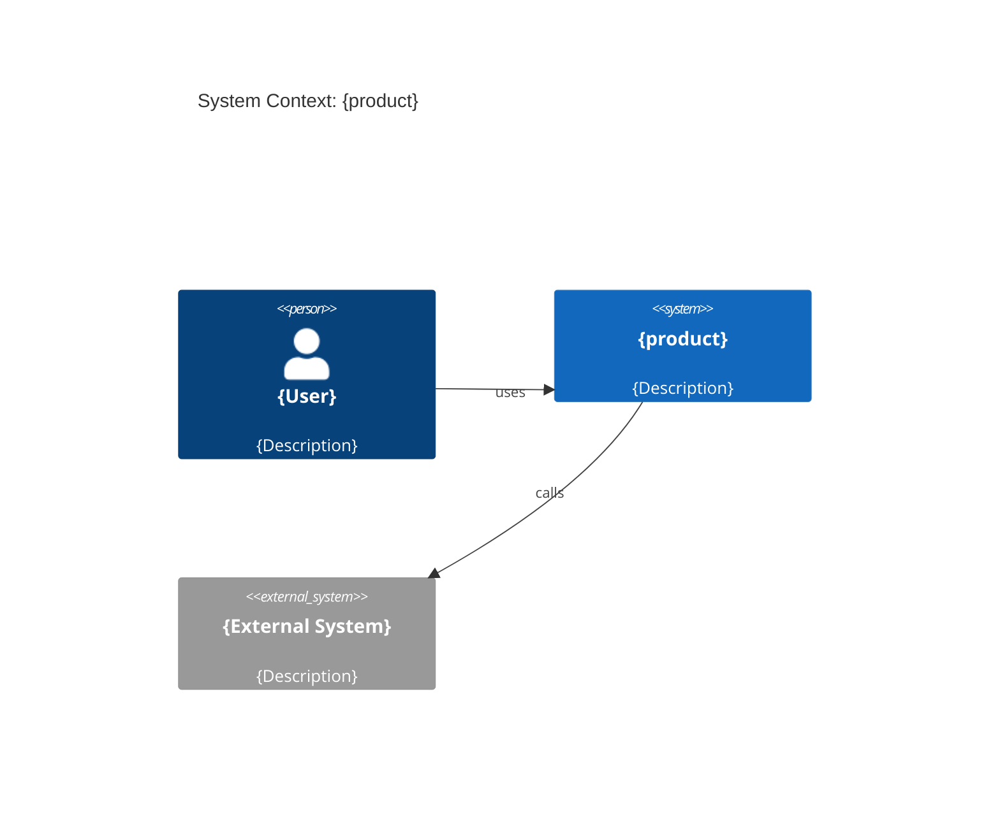
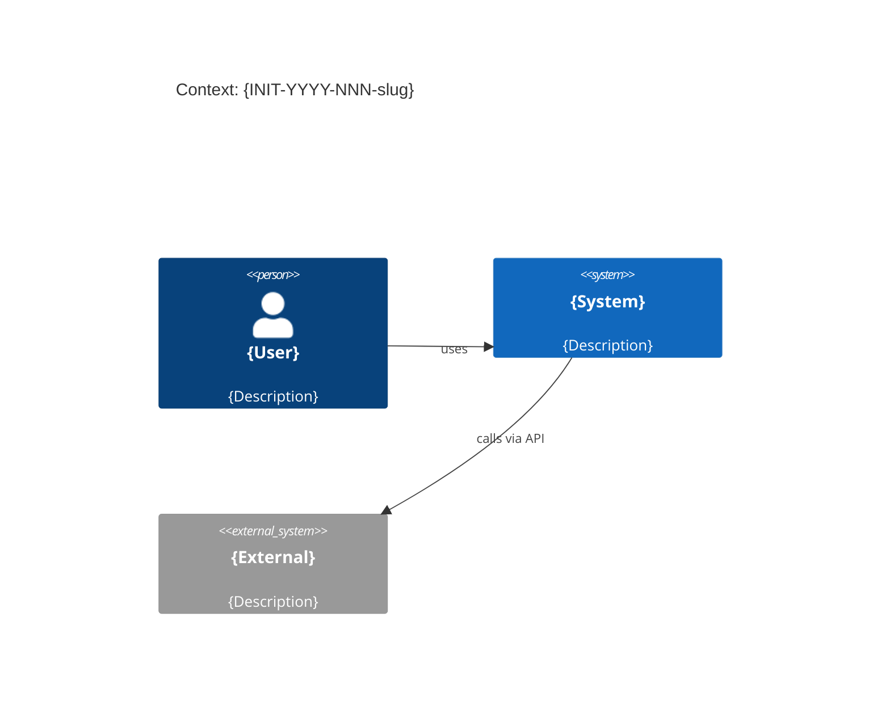

# Spec-Kit File Structure Implementation Plan

> **For Claude:** REQUIRED SUB-SKILL: Use superpowers:executing-plans to implement this plan task-by-task.

**Goal:** Create the full L0–L5 artifact file hierarchy for Product-base-Spec-Kit based on the Spec Constitution document, with all files containing complete {placeholder}-style templates.

**Architecture:** Approach A — `.specify/` as governance center (L0 constitution + L4 spec-kit), `domains/`, `products/`, `initiatives/` for L1–L3 templates, `tools/schemas/` for CI validators, `evidence/` placeholder for L5.

**Tech Stack:** Markdown (templates), YAML (requirements.yml, slo.yaml), JSON Schema 2020-12, OpenAPI 3.1.1, AsyncAPI 3.0, Keep a Changelog + SemVer.

**Design doc:** `docs/plans/2026-02-28-spec-kit-file-structure-design.md`

---

### Task 1: L0 Governance — .specify/memory/constitution.md

**Files:**
- Create: `.specify/memory/constitution.md`

**Step 1: Create directory**

```bash
mkdir -p .specify/memory
```

**Step 2: Create constitution.md**

```markdown
# Spec Constitution

> Операционная система изменений для B2B SaaS-платформы.
> Версия: 1.0.0 | Последнее обновление: {YYYY-MM-DD}

---

## Нормативные термины (BCP 14 / RFC 2119 + RFC 8174)

- **MUST** / **MUST NOT** — обязательное требование.
- **SHOULD** / **SHOULD NOT** — рекомендация; допустимо отклонение с явным обоснованием.
- **MAY** — необязательно, по усмотрению команды.

---

## Источники истины (Source of Truth)

| Артефакт | Канонический файл |
|---|---|
| Требования | `requirements.yml` |
| Интерфейсы REST | `contracts/openapi.yaml` |
| Интерфейсы событий | `contracts/asyncapi.yaml` |
| SLO | `ops/slo.yaml` |
| Архитектурные решения | `decisions/*.md` |

Narrative-документы (`prd.md`, `design.md`, `runbooks`) MUST ссылаться на anchors выше и НЕ дублировать их.

---

## Двухконтурный workflow (обязательная модель)

### Lifecycle-контур (L3 Initiative)
```
Discovery → Product → Architecture/Contracts → Ops/Readiness → Evidence
```

### Spec-Driven контур (L4 Feature)
```
spec → plan → tasks → implement
```
Формат L4-файлов MUST быть совместим с `.specify/specs/` и шаблонами из этого репозитория.

---

## Уровни и профили обязательности

| Уровень | Профиль | Описание |
|---|---|---|
| L0 | — | Governance: эта конституция, platform templates, platform ADR |
| L1 | Domain | `domains/<domain>/` — глоссарий, canonical model, event catalog |
| L2 | Product | `products/<product>/` — архитектура, product ADR, NFR baseline |
| L3 | Initiative | Инициатива: prd.md, requirements.yml, contracts/, ops/, decisions/ |
| L4 | Feature | Фича: .specify/specs/{NNN}-{slug}/ spec/plan/tasks |
| L5 | Evidence | CI-генерируемые отчёты: RTM, coverage, PRR status |

**Профили обязательности** задают глубину L3:

- **Minimal** — prd.md, requirements.yml, README.md, CHANGELOG.md
- **Standard** — Minimal + design.md, ADR, contracts/*, rollout.md, slo.yaml, prr-checklist.md
- **Extended** — Standard + threat-model.md, nfr-validation.md, migration.md, compliance/

Профиль выбирается **по риску**, а не «по размеру фичи».

---

## Принципы (MUST / SHOULD)

1. **Machine-readable first (MUST):** всё, влияющее на интеграции/совместимость/эксплуатацию, фиксируется в machine-readable anchors и валидируется CI.
2. **Single source of truth (MUST):** один объект знания — один канонический файл.
3. **Traceability by construction (MUST):** каждый `REQ-ID` имеет ссылки минимум на 1 подтверждение (тест / contract-тест / измерение SLO).
4. **ADR-as-PR (SHOULD):** решения оформляются ADR и ревьюятся в PR.
5. **Контракты обратимо-совместимы по умолчанию (MUST):** breaking changes требуют отдельного deprecation-процесса и major-сдвига.

---

## ID-схемы

```
Initiative:    INIT-YYYY-NNN-<slug>      # INIT-2026-003-export-data
Requirements:  REQ-<SCOPE>-NNN          # REQ-AUTH-042, REQ-PLAT-003
Platform ADR:  PLAT-0001-<slug>
Product ADR:   <PROD>-0001-<slug>       # ANALYTICS-0003-cache-strategy
Initiative ADR:<INIT>-ADR-0001-<slug>   # INIT-2026-003-ADR-0002-event-schema
API version:   SemVer (major.minor.patch)
```

Все ID MUST быть короткими, стабильными, ASCII-совместимыми и сортируемыми.

---

## CI Gates — стратегия enforcement

Любой gate вводится в 2 этапа:
1. **Warning mode** на PR в течение 2 недель (с отчётами в PR/чат).
2. **Blocking mode** на merge/release для профилей Standard/Extended.

| CI-проверка | Инструменты | PR | Release | Профили |
|---|---|---|---|---|
| YAML/Markdown hygiene | yamllint, markdownlint-cli2 | warning→blocking | blocking | все |
| requirements schema | check-jsonschema | blocking | blocking | все |
| OpenAPI validate + lint | Redocly CLI / Spectral | warning (style) / blocking (errors) | blocking | Standard/Extended |
| OpenAPI breaking diff | oasdiff | blocking (без major) | blocking | Standard/Extended |
| AsyncAPI validate | AsyncAPI CLI / Spectral | warning→blocking | blocking | Standard/Extended |
| AsyncAPI breaking diff | @asyncapi/diff | warning→blocking | blocking | Standard/Extended |
| JSON Schema validate | check-jsonschema + metaschema | blocking | blocking | все |
| SLO format | local JSON Schema + check-jsonschema | warning→blocking | blocking | Standard/Extended |
| PRR gate | чек-лист + парсер | warning (PR) | blocking (release) | Standard/Extended |
| Changelog discipline | Keep a Changelog + SemVer | warning→blocking | blocking | все |

---

## Ссылки

- MADR: https://adr.github.io/madr/
- arc42: https://arc42.org/documentation/
- OpenAPI 3.1.1: https://spec.openapis.org/oas/v3.1.1
- AsyncAPI 3.0: https://www.asyncapi.com/docs/reference/specification/v3.0.0
- OpenSLO v1: https://github.com/OpenSLO/OpenSLO
- Keep a Changelog: https://keepachangelog.com/
- SemVer: https://semver.org/
- Redocly CLI: https://redocly.com/docs/cli/
- Spectral: https://stoplight.io/open-source/spectral
- oasdiff: https://github.com/oasdiff/oasdiff
- check-jsonschema: https://github.com/python-jsonschema/check-jsonschema
```

**Step 3: Verify file exists**

```bash
ls -la .specify/memory/constitution.md
```
Expected: file ~4KB

**Step 4: Commit**

```bash
git add .specify/memory/constitution.md
git commit -m "feat: add L0 spec constitution"
```

---

### Task 2: L0 Feature Spec-Kit — .specify/specs/ templates

**Files:**
- Create: `.specify/specs/{NNN}-{slug}/spec.md`
- Create: `.specify/specs/{NNN}-{slug}/plan.md`
- Create: `.specify/specs/{NNN}-{slug}/tasks.md`
- Create: `.specify/specs/{NNN}-{slug}/trace.md`
- Create: `.specify/specs/README.md`

**Step 1: Create directories**

```bash
mkdir -p ".specify/specs/{NNN}-{slug}"
```

**Step 2: Create .specify/specs/README.md**

```markdown
# .specify/specs/

Директория для L4 Feature spec-kit.

## Использование

1. Скопировать папку `{NNN}-{slug}/` с новым именем: `042-export-csv/`
2. Заполнить все `{placeholder}` в файлах
3. Связать `REQ-ID` с записями в `../../../initiatives/{INIT}/requirements.yml`

## Структура

```
{NNN}-{slug}/
  spec.md    ← что делаем и зачем
  plan.md    ← архитектурные решения и impact
  tasks.md   ← task-checklist для инженера
  trace.md   ← RTM: REQ → контракты/тесты/SLO
```
```

**Step 3: Create spec.md**

```markdown
<!-- FILE: .specify/specs/{NNN}-{slug}/spec.md -->
# Spec: {NNN}-{slug}

**Initiative:** {INIT-YYYY-NNN-slug}
**Profile:** {Minimal|Standard|Extended}
**Owner:** @{engineer-or-team}
**Last updated:** {YYYY-MM-DD}

## Summary

{1–3 предложения: что меняем и зачем}

## Motivation / Problem

{Почему нужно; ссылка на PRD, если есть: `../../../initiatives/{INIT}/prd.md`}

## Scope / Non-goals

**In-scope:**
- {…}

**Non-goals:**
- {…}

## User stories

- As a {role}, I want {capability}, so that {benefit}.
- As a {role}, I want {capability}, so that {benefit}.

## Requirements

Ссылки на REQ-ID (реестр в `requirements.yml`):

- `REQ-{SCOPE}-{NNN}` (P0): {кратко}
- `REQ-{SCOPE}-{NNN}` (P1): {кратко}

## Acceptance criteria

- Given {context} When {action} Then {result}
- Given {context} When {action} Then {result}
```

**Step 4: Create plan.md**

```markdown
<!-- FILE: .specify/specs/{NNN}-{slug}/plan.md -->
# Plan: {NNN}-{slug}

**Initiative:** {INIT-YYYY-NNN-slug}
**Owner:** @{engineer-or-team}
**Last updated:** {YYYY-MM-DD}

## Architecture choices

- {Ключевое решение 1} → ADR: `decisions/{INIT}-ADR-{NNN}-{slug}.md` (если создан)
- {Ключевое решение 2}

## Contracts impact

**OpenAPI** (`contracts/openapi.yaml`):
- `POST /path` — {добавляем / изменяем / удаляем}
- `GET /path/{id}` — {…}

**AsyncAPI** (`contracts/asyncapi.yaml`):
- Channel `{name}` — {…}

**Schemas** (`contracts/schemas/`):
- `{entity}.schema.json` — {новая / изменённая схема}

## Data changes

- {Таблица/коллекция}: {добавляем поле / индекс / миграция}
- Migration script: `delivery/migration.md` (если Extended)

## Observability & SLO impact

- Метрики: {gauge/counter/histogram — что добавляем}
- Логи: {что структурируем, какие поля}
- Трейсы: {span-ы, если применимо}
- SLO: `ops/slo.yaml#{{slo-name}}` — {обновляем / создаём}

## Rollout & rollback

- Feature flag: `{flag-name}` — {включаем постепенно / нет}
- Canary: {да/нет, процент}
- Rollback: {описание шагов отката}
- Подробности: `delivery/rollout.md`

## Risks

- {Риск 1} → mitigation: {…}
- {Риск 2} → mitigation: {…}
```

**Step 5: Create tasks.md**

```markdown
<!-- FILE: .specify/specs/{NNN}-{slug}/tasks.md -->
# Tasks: {NNN}-{slug}

**Initiative:** {INIT-YYYY-NNN-slug}
**Owner:** @{engineer-or-team}

## Task list

- [ ] **T1:** Добавить/обновить контракт (OpenAPI/AsyncAPI) + прогнать линтеры локально
- [ ] **T2:** Реализовать изменение (код) + unit tests
- [ ] **T3:** Contract tests / интеграционные тесты (если применимо)
- [ ] **T4:** Observability — добавить метрики/алерты, обновить `ops/slo.yaml` (Standard/Extended)
- [ ] **T5:** Обновить `trace.md` + `changelog/CHANGELOG.md`
- [ ] **T6:** Пройти PRR пункты из `ops/prr-checklist.md` (Standard/Extended)

## Definition of done (по профилю)

| Чекпойнт | Minimal | Standard | Extended |
|---|---|---|---|
| requirements.yml заполнен | MUST | MUST | MUST |
| spec/plan/tasks.md заполнены | MUST | MUST | MUST |
| Контракты валидны (lint/validate) | — | MUST | MUST |
| trace.md заполнен | — | MUST | MUST |
| slo.yaml и prr-checklist.md | — | MUST | MUST |
| threat-model.md | — | — | MUST |
| CI gates зелёные | MUST | MUST | MUST |
```

**Step 6: Create trace.md (spec-level)**

```markdown
<!-- FILE: .specify/specs/{NNN}-{slug}/trace.md -->
# Traceability: {NNN}-{slug}

| REQ-ID | ADR | Contract | Schema | Tests | SLO |
|---|---|---|---|---|---|
| `REQ-{SCOPE}-{NNN}` | `decisions/{INIT}-ADR-{NNN}-{slug}` | `contracts/openapi.yaml#/paths/~1{path}/post` | `contracts/schemas/{entity}.schema.json` | `tests/e2e/{test}::REQ-{SCOPE}-{NNN}` | `ops/slo.yaml#{slo-name}` |
| `REQ-{SCOPE}-{NNN}` | — | — | — | `tests/perf/{test}::REQ-{SCOPE}-{NNN}` | `ops/slo.yaml#{slo-name}` |
```

**Step 7: Verify**

```bash
ls .specify/specs/{NNN}-{slug}/
```
Expected: spec.md plan.md tasks.md trace.md

**Step 8: Commit**

```bash
git add .specify/
git commit -m "feat: add L0 spec-kit feature templates (.specify/specs/)"
```

---

### Task 3: L0 Tools — requirements.schema.json

**Files:**
- Create: `tools/schemas/requirements.schema.json`
- Create: `tools/schemas/README.md`

**Step 1: Create directories**

```bash
mkdir -p tools/schemas
```

**Step 2: Create requirements.schema.json**

```json
{
  "$schema": "https://json-schema.org/draft/2020-12/schema",
  "$id": "https://example.local/schemas/requirements.schema.json",
  "title": "requirements.yml schema",
  "type": "object",
  "required": ["metadata", "requirements"],
  "additionalProperties": false,
  "properties": {
    "metadata": {
      "type": "object",
      "required": ["initiative", "product", "owner", "profile", "version", "last_updated"],
      "additionalProperties": true,
      "properties": {
        "initiative": { "type": "string", "pattern": "^INIT-[0-9]{4}-[0-9]{3}-[a-z0-9-]+$" },
        "product":    { "type": "string", "minLength": 1 },
        "owner":      { "type": "string", "minLength": 1 },
        "profile":    { "type": "string", "enum": ["minimal", "standard", "extended"] },
        "version":    { "type": "string", "pattern": "^[0-9]+\\.[0-9]+\\.[0-9]+(-[0-9A-Za-z.-]+)?$" },
        "last_updated": { "type": "string", "format": "date" }
      }
    },
    "requirements": {
      "type": "array",
      "minItems": 1,
      "items": { "$ref": "#/$defs/requirement" }
    }
  },
  "$defs": {
    "requirement": {
      "type": "object",
      "required": ["id", "title", "type", "priority", "status", "description", "trace"],
      "additionalProperties": false,
      "properties": {
        "id":          { "type": "string", "pattern": "^REQ-[A-Z0-9]{2,16}-[0-9]{3}$" },
        "title":       { "type": "string", "minLength": 3 },
        "type":        { "type": "string", "enum": ["functional", "nfr", "constraint", "compliance"] },
        "priority":    { "type": "string", "enum": ["P0", "P1", "P2", "P3"] },
        "status":      { "type": "string", "enum": ["draft", "proposed", "approved", "implemented", "verified", "deprecated"] },
        "description": { "type": "string", "minLength": 10 },
        "acceptance_criteria": {
          "type": "array",
          "items": { "type": "string", "minLength": 5 }
        },
        "metrics": {
          "type": "array",
          "items": {
            "type": "object",
            "required": ["name", "target", "measurement"],
            "additionalProperties": false,
            "properties": {
              "name":        { "type": "string", "minLength": 2 },
              "target":      { "type": ["number", "string"] },
              "measurement": { "type": "string", "minLength": 2 }
            }
          }
        },
        "trace": {
          "type": "object",
          "additionalProperties": true,
          "properties": {
            "prd":       { "type": "string" },
            "adr":       { "type": "array", "items": { "type": "string" } },
            "contracts": { "type": "array", "items": { "type": "string" } },
            "schemas":   { "type": "array", "items": { "type": "string" } },
            "tests":     { "type": "array", "items": { "type": "string" } },
            "slo":       { "type": "string" },
            "components":{ "type": "array", "items": { "type": "string" } }
          }
        }
      },
      "allOf": [
        {
          "if":   { "properties": { "type": { "const": "functional" } } },
          "then": { "required": ["acceptance_criteria"] }
        },
        {
          "if":   { "properties": { "type": { "const": "nfr" } } },
          "then": { "required": ["metrics"] }
        }
      ]
    }
  }
}
```

**Step 3: Create tools/schemas/README.md**

```markdown
# tools/schemas/

CI-валидаторы (JSON Schema) для machine-readable артефактов.

| Схема | Валидирует | Инструмент |
|---|---|---|
| `requirements.schema.json` | `requirements.yml` во всех инициативах | `check-jsonschema` |

## Использование

```bash
check-jsonschema --schemafile tools/schemas/requirements.schema.json \
  initiatives/{INIT}/requirements.yml
```
```

**Step 4: Commit**

```bash
git add tools/
git commit -m "feat: add L0 JSON Schema validator for requirements.yml"
```

---

### Task 4: L1 Domain hierarchy

**Files:**
- Create: `domains/{domain}/glossary.md`
- Create: `domains/{domain}/canonical-model/model.md`
- Create: `domains/{domain}/event-catalog/events.md`
- Create: `domains/{domain}/nfr/domain-nfr.md`
- Create: `domains/{domain}/regulatory/requirements.md`
- Create: `domains/README.md`

**Step 1: Create directories**

```bash
mkdir -p "domains/{domain}/canonical-model" \
         "domains/{domain}/event-catalog" \
         "domains/{domain}/nfr" \
         "domains/{domain}/regulatory"
```

**Step 2: Create domains/README.md**

```markdown
# domains/

L1 Domain-уровень. Каждая папка — один домен.

Переименуйте `{domain}` в реальное название домена (например: `billing`, `auth`, `analytics`).

## Профили обязательности

| Файл | Когда создавать |
|---|---|
| `glossary.md` | При добавлении новых терминов/сущностей — **Minimal** |
| `canonical-model/model.md` | При изменении доменной модели/событий — **Standard+** |
| `event-catalog/events.md` | При изменении доменных событий — **Standard+** |
| `nfr/domain-nfr.md` | При затрагивании данных/зон риска — **Extended** |
| `regulatory/requirements.md` | При регуляторных требованиях — **Extended** |
```

**Step 3: Create glossary.md**

```markdown
# Glossary: {domain}

**Домен:** {domain}
**Владелец:** @{domain-team}
**Последнее обновление:** {YYYY-MM-DD}

## Термины

| Термин | Определение | Синонимы | Источник |
|---|---|---|---|
| {Term} | {Definition} | {aliases} | {link-or-ADR} |
| {Term} | {Definition} | — | — |

## Канонические сущности

| Сущность | Описание | Схема |
|---|---|---|
| {Entity} | {Description} | `canonical-model/{entity}.schema.json` |
```

**Step 4: Create canonical-model/model.md**

```markdown
# Canonical Model: {domain}

**Профиль:** Standard+
**Последнее обновление:** {YYYY-MM-DD}

## Обзор

{Описание доменной модели — основные агрегаты, их связи}

## Сущности

### {EntityName}

| Поле | Тип | Обязательное | Описание |
|---|---|---|---|
| `id` | string | MUST | Уникальный идентификатор |
| `{field}` | {type} | {MUST\|SHOULD\|MAY} | {description} |

**Инварианты:**
- {бизнес-правило 1}
- {бизнес-правило 2}

## Диаграмма (mermaid)

```mermaid
erDiagram
    {ENTITY_A} {
        string id
        string field1
    }
    {ENTITY_B} {
        string id
        string entity_a_id
    }
    {ENTITY_A} ||--o{ {ENTITY_B} : "has"
```
```

**Step 5: Create event-catalog/events.md**

```markdown
# Event Catalog: {domain}

**Профиль:** Standard+
**Последнее обновление:** {YYYY-MM-DD}

## События

| Event name | Version | Producer | Consumers | Schema |
|---|---|---|---|---|
| `{domain}.{entity}.{action}` | `1.0.0` | `{service}` | `{service-list}` | `contracts/schemas/{event}.schema.json` |

## {domain}.{entity}.{action} v1.0.0

**Триггер:** {когда публикуется}
**Payload:**

```json
{
  "eventId": "{uuid}",
  "occurredAt": "{ISO8601}",
  "data": {
    "{field}": "{value}"
  }
}
```

**Семантика:** {что означает, что делать consumer-ам}
```

**Step 6: Create nfr/domain-nfr.md**

```markdown
# Domain NFR: {domain}

**Профиль:** Extended
**Последнее обновление:** {YYYY-MM-DD}

## Данные и зоны риска

| Классификация | Типы данных | Зоны риска |
|---|---|---|
| {classification} | {data types} | {risk zones} |

## NFR-требования

| REQ-ID | Категория | Требование | Метрика |
|---|---|---|---|
| `REQ-{DOMAIN}-{NNN}` | {privacy\|security\|reliability} | {description} | {metric} |

## Регуляторные ограничения

- {Regulation 1}: {impact on domain}
- {Regulation 2}: {impact on domain}

Подробности: `regulatory/requirements.md`
```

**Step 7: Create regulatory/requirements.md**

```markdown
# Regulatory Requirements: {domain}

**Профиль:** Extended
**Последнее обновление:** {YYYY-MM-DD}

## Применимые регуляции

| Регуляция | Статус | Ответственный | Ссылка |
|---|---|---|---|
| {Regulation} | {applicable\|not-applicable\|under-review} | @{owner} | {link} |

## Требования

| REQ-ID | Регуляция | Требование | Подтверждение |
|---|---|---|---|
| `REQ-{DOMAIN}-{NNN}` | {reg} | {requirement} | `compliance/regulatory-review.md` |
```

**Step 8: Commit**

```bash
git add domains/
git commit -m "feat: add L1 domain hierarchy templates"
```

---

### Task 5: L2 Product hierarchy

**Files:**
- Create: `products/{product}/architecture/overview.md`
- Create: `products/{product}/decisions/{PROD}-0001-{slug}.md`
- Create: `products/{product}/nfr-baseline/baseline.md`
- Create: `products/README.md`

**Step 1: Create directories**

```bash
mkdir -p "products/{product}/architecture" \
         "products/{product}/decisions" \
         "products/{product}/nfr-baseline"
```

**Step 2: Create products/README.md**

```markdown
# products/

L2 Product-уровень. Каждая папка — один продукт.

Переименуйте `{product}` в реальное название продукта (например: `analytics`, `billing`, `api-gateway`).

| Файл | Когда создавать |
|---|---|
| `architecture/overview.md` | При изменении product context — **Minimal** |
| `decisions/{PROD}-0001-{slug}.md` | При архитектурных развилках — **Standard+** |
| `nfr-baseline/baseline.md` | Privacy/security/reliability baseline — **Standard+** |
```

**Step 3: Create architecture/overview.md**

```markdown
# Architecture: {product}

**Продукт:** {product}
**Владелец:** @{tech-lead}
**Последнее обновление:** {YYYY-MM-DD}

## Контекст (C4: Context)

{Описание системы, внешних акторов и систем}



## Контейнеры (C4: Container)

| Сервис | Ответственность | Технология | Репозиторий |
|---|---|---|---|
| `{service}` | {responsibility} | {tech} | `{repo-link}` |

## Ключевые ADR

- `decisions/{PROD}-0001-{slug}.md` — {краткий смысл}

## Домены

- Относится к домену: `domains/{domain}/`
```

**Step 4: Create decisions/{PROD}-0001-{slug}.md**

```markdown
---
status: "proposed"
date: "{YYYY-MM-DD}"
decision-makers: ["@{techlead}", "@{architect}"]
consulted: ["@{security}", "@{sre}"]
informed: ["@{product}", "@{support}"]
---

# {PROD}-0001: {Короткий заголовок решения}

## Context and problem statement

{Что происходит, какая боль/ограничение, какие требования/ASR}

## Decision drivers

- {driver 1}
- {driver 2}

## Considered options

- **Option A:** {кратко}
- **Option B:** {кратко}
- **Option C:** {кратко}

## Decision outcome

**Chosen option:** "{A|B|C}", because {рационал, trade-offs}.

### Consequences

- **Good:** {…}
- **Bad:** {…}
- **Neutral:** {…}

### Confirmation

{Как мы проверим, что решение "работает": тест/метрика/ревью}
```

**Step 5: Create nfr-baseline/baseline.md**

```markdown
# NFR Baseline: {product}

**Профиль:** Standard+
**Последнее обновление:** {YYYY-MM-DD}

## Privacy

| Требование | Уровень | Описание |
|---|---|---|
| Data classification | MUST | {классификация данных продукта} |
| Data retention | MUST | {сроки хранения} |
| PII handling | MUST | {как обрабатывается PII} |

## Security

| Требование | Уровень | Описание |
|---|---|---|
| Authentication | MUST | {механизм аутентификации} |
| Authorization | MUST | {модель авторизации} |
| Secrets management | MUST | {как управляются секреты} |

## Reliability

| Метрика | Target | Метод измерения |
|---|---|---|
| Availability | {99.9%} | SLO в `ops/slo.yaml` |
| Latency P95 | {300ms} | APM |
| Error rate | {<0.1%} | APM |
```

**Step 6: Commit**

```bash
git add products/
git commit -m "feat: add L2 product hierarchy templates"
```

---

### Task 6: L3 Initiative — core files

**Files:**
- Create: `initiatives/{INIT-YYYY-NNN-slug}/README.md`
- Create: `initiatives/{INIT-YYYY-NNN-slug}/prd.md`
- Create: `initiatives/{INIT-YYYY-NNN-slug}/requirements.yml`
- Create: `initiatives/{INIT-YYYY-NNN-slug}/trace.md`
- Create: `initiatives/README.md`

**Step 1: Create directories**

```bash
mkdir -p "initiatives/{INIT-YYYY-NNN-slug}"
```

**Step 2: Create initiatives/README.md**

```markdown
# initiatives/

L3 Initiative-уровень. Каждая папка — одна инициатива.

## Использование

1. Скопировать `{INIT-YYYY-NNN-slug}/` → `INIT-2026-042-my-feature/`
2. Заполнить все `{placeholder}` в файлах
3. Выбрать профиль: Minimal / Standard / Extended
4. Удалить файлы профилей выше выбранного (Extended-файлы не нужны для Minimal)

## Профили

| Профиль | Обязательные файлы |
|---|---|
| **Minimal** | README.md, prd.md, requirements.yml, changelog/CHANGELOG.md |
| **Standard** | + design.md, decisions/*, contracts/*, trace.md, delivery/rollout.md, ops/slo.yaml, ops/prr-checklist.md |
| **Extended** | + delivery/migration.md, ops/nfr-validation.md, ops/threat-model.md, compliance/regulatory-review.md |

## Инструменты CI

```bash
# Проверить requirements.yml
check-jsonschema --schemafile ../../tools/schemas/requirements.schema.json requirements.yml

# Линт OpenAPI
redocly lint contracts/openapi.yaml

# Проверить breaking changes OpenAPI
oasdiff breaking contracts/openapi.yaml <base-version>
```
```

**Step 3: Create README.md (initiative index)**

```markdown
# {INIT-YYYY-NNN-slug}

**Initiative:** {INIT-YYYY-NNN-slug}
**Profile:** {Minimal|Standard|Extended}
**Status:** {discovery|product|architecture|ops|evidence}
**Owner (PM):** @{team-or-person}
**Tech Lead:** @{engineer}
**Last updated:** {YYYY-MM-DD}

## Описание

{1–2 предложения: что делаем и зачем}

## Артефакты инициативы

| Файл | Статус | Описание |
|---|---|---|
| `prd.md` | {draft\|approved} | Product Requirements Document |
| `requirements.yml` | {draft\|approved} | Machine-readable registry |
| `design.md` | {draft\|approved} | Architecture design (arc42-lite) |
| `trace.md` | {draft\|current} | Traceability matrix |
| `contracts/openapi.yaml` | {draft\|stable} | REST API contract |
| `ops/slo.yaml` | {draft\|approved} | SLO definition |
| `ops/prr-checklist.md` | {open\|passed} | Production Readiness Review |
| `changelog/CHANGELOG.md` | current | Change log |

## Связанные L4 спеки

- `.specify/specs/{NNN}-{slug}/` — {описание фичи}

## Связанные домены и продукты

- Domain: `domains/{domain}/`
- Product: `products/{product}/`
```

**Step 4: Create prd.md**

```markdown
<!-- FILE: prd.md -->
# PRD: {Название инициативы}

**Initiative:** {INIT-YYYY-NNN-slug}
**Owner (PM):** @{team-or-person}
**Last updated:** {YYYY-MM-DD}
**Profile:** {Minimal|Standard|Extended}

---

## Цель и ожидаемый эффект

- **Проблема:** {кратко — что болит у пользователя/бизнеса}
- **Почему сейчас:** {триггер/сигналы — данные, события, дедлайны}
- **Цель (Outcome):** {измеримый результат — не output, а outcome}

## Пользователи и сценарии

- **Primary personas:** {кто пользуется}
- **Top JTBD / сценарии:**
  1. {Сценарий 1}
  2. {Сценарий 2}
  3. {Сценарий 3}

## Метрики успеха

| Метрика | Baseline | Target | Период | Источник |
|---|---:|---:|---|---|
| {kpi_1} | {x} | {y} | {30d\|90d} | {BI\|APM\|…} |
| {kpi_2} | {x} | {y} | {30d\|90d} | {BI\|APM\|…} |

## Scope

**In-scope:** {что делаем}
**Non-goals:** {что сознательно не делаем — это важно}

## Риски и ограничения

- **{Risk 1}:** {mitigation}
- **{Risk 2}:** {mitigation}

## Требования (ссылки на REQ)

Реестр требований — в `requirements.yml`. Здесь только ссылки:

- `REQ-{SCOPE}-{NNN}` (P0): {краткий смысл}
- `REQ-{SCOPE}-{NNN}` (P1): {краткий смысл}

## Приёмка

- Acceptance tests: `tests/{path}` — {описание}
- Definition of done по профилю: `.specify/memory/constitution.md#профили`
```

**Step 5: Create requirements.yml**

```yaml
# FILE: requirements.yml
# Реестр требований инициативы. Валидируется JSON Schema:
#   tools/schemas/requirements.schema.json
# Команда: check-jsonschema --schemafile ../../tools/schemas/requirements.schema.json requirements.yml

metadata:
  initiative: "{INIT-YYYY-NNN-slug}"   # e.g. INIT-2026-003-export-data
  product: "{product}"                  # e.g. analytics
  owner: "@{team}"                      # e.g. @analytics-team
  profile: "{minimal|standard|extended}"
  version: "0.1.0"
  last_updated: "{YYYY-MM-DD}"

requirements:
  - id: "REQ-{SCOPE}-001"
    title: "{Краткое название требования}"
    type: "functional"      # functional | nfr | constraint | compliance
    priority: "P0"          # P0 | P1 | P2 | P3
    status: "draft"         # draft | proposed | approved | implemented | verified | deprecated
    description: >
      {Пользователь MUST иметь возможность … Полное описание требования.}
    acceptance_criteria:
      - "Given {context} When {action} Then {result}"
      - "Given {context} When {action} Then {result}"
    trace:
      adr:
        - "{INIT-YYYY-NNN-slug}-ADR-0001-{slug}"
      contracts:
        - "contracts/openapi.yaml#/paths/~1{path}/post"
      schemas:
        - "contracts/schemas/{entity}.schema.json"
      tests:
        - "tests/e2e/{test}.spec.ts::REQ-{SCOPE}-001"
      components:
        - "{service-name}"

  - id: "REQ-{SCOPE}-002"
    title: "{NFR-требование: latency / availability / …}"
    type: "nfr"
    priority: "P1"
    status: "draft"
    description: >
      {API endpoint SHOULD отвечать быстро при нормальной нагрузке.}
    metrics:
      - name: "{metric_name_p95_ms}"
        target: 300
        measurement: "apm"
      - name: "{metric_name_p95_seconds}"
        target: 120
        measurement: "job-metrics"
    trace:
      slo: "ops/slo.yaml#{slo-name}"
      tests:
        - "tests/perf/{test}.jmx::REQ-{SCOPE}-002"
      components:
        - "{service-name}"
```

**Step 6: Create trace.md (initiative-level)**

```markdown
<!-- FILE: trace.md -->
# Traceability: {INIT-YYYY-NNN-slug}

**Профиль:** Standard+
**Последнее обновление:** {YYYY-MM-DD}

> RTM генерируется автоматически из `requirements.yml` в CI (L5).
> Этот файл — человекочитаемый вид; поддерживайте синхронно с `requirements.yml`.

| REQ-ID | Priority | ADR | Contract | Schema | Tests | SLO |
|---|---|---|---|---|---|---|
| `REQ-{SCOPE}-001` | P0 | `decisions/{INIT}-ADR-0001-{slug}` | `contracts/openapi.yaml#/paths/~1{path}/post` | `contracts/schemas/{entity}.schema.json` | `tests/e2e/{test}::REQ-{SCOPE}-001` | `ops/slo.yaml#{slo-name}` |
| `REQ-{SCOPE}-002` | P1 | — | — | — | `tests/perf/{test}.jmx::REQ-{SCOPE}-002` | `ops/slo.yaml#{slo-name}` |
```

**Step 7: Commit**

```bash
git add initiatives/
git commit -m "feat: add L3 initiative core templates (README, prd, requirements, trace)"
```

---

### Task 7: L3 Initiative — design.md + changelog

**Files:**
- Create: `initiatives/{INIT-YYYY-NNN-slug}/design.md`
- Create: `initiatives/{INIT-YYYY-NNN-slug}/changelog/CHANGELOG.md`

**Step 1: Create changelog directory**

```bash
mkdir -p "initiatives/{INIT-YYYY-NNN-slug}/changelog"
```

**Step 2: Create design.md (arc42-lite)**

```markdown
<!-- FILE: design.md -->
# Design: {INIT-YYYY-NNN-slug}

**Owner (Tech Lead):** @{team-or-person}
**Profile:** {Minimal|Standard|Extended}
**Last updated:** {YYYY-MM-DD}
**Related:** `prd.md`, `requirements.yml`, `decisions/`, `contracts/`, `ops/`

---

## Цели и ограничения

- **Goals:**
  1. {Goal 1}
  2. {Goal 2}
- **Constraints (MUST):** {регуляторика / latency / SLA / технологии / …}

## Контекст и границы (C4: Context)

- **Системы и акторы:** {список внешних систем и пользователей}
- **Trust boundaries** (Extended): {кратко}



## Архитектурная стратегия

- **Основной подход:** {async jobs | event-driven | sync API | …}
- **Почему:** {decision drivers → `decisions/{INIT}-ADR-0001-{slug}.md`}

## Ключевые строительные блоки (C4: Container)

| Контейнер | Ответственность | Данные | Масштабирование | Риски |
|---|---|---|---|---|
| `{service}` | {…} | {…} | {horizontal/vertical} | {…} |

## Контракты и данные

- **OpenAPI:** `contracts/openapi.yaml`
- **AsyncAPI** (если есть): `contracts/asyncapi.yaml`
- **JSON Schema:** `contracts/schemas/*.json`

## Качество и NFR (quality scenarios)

- **Performance:** {цели → `REQ-{SCOPE}-{NNN}`}
- **Reliability:** {SLO → `ops/slo.yaml`}
- **Security/Privacy** (Extended): `ops/threat-model.md`

## Развёртывание и миграции

- **Rollout strategy:** `delivery/rollout.md`
- **Data migration:** `delivery/migration.md` (Extended)

## Открытые вопросы

- {Q1} (owner: @{name}, due: {YYYY-MM-DD})
- {Q2} (owner: @{name}, due: {YYYY-MM-DD})
```

**Step 3: Create changelog/CHANGELOG.md**

```markdown
# Changelog

All notable changes to this initiative will be documented in this file.
Format: [Keep a Changelog](https://keepachangelog.com/en/1.1.0/)
Versioning: [SemVer](https://semver.org/)

## [Unreleased]

### Added

- {…}

### Changed

- {…}

### Deprecated

- {…}

### Removed

- {…}

### Fixed

- {…}

### Security

- {…}

## [0.1.0] - {YYYY-MM-DD}

### Added

- Initial specification draft.
```

**Step 4: Commit**

```bash
git add "initiatives/{INIT-YYYY-NNN-slug}/design.md" \
        "initiatives/{INIT-YYYY-NNN-slug}/changelog/"
git commit -m "feat: add L3 design.md (arc42-lite) and CHANGELOG templates"
```

---

### Task 8: L3 Initiative — contracts/

**Files:**
- Create: `initiatives/{INIT-YYYY-NNN-slug}/contracts/openapi.yaml`
- Create: `initiatives/{INIT-YYYY-NNN-slug}/contracts/asyncapi.yaml`
- Create: `initiatives/{INIT-YYYY-NNN-slug}/contracts/schemas/{entity}.schema.json`
- Create: `initiatives/{INIT-YYYY-NNN-slug}/contracts/README.md`

**Step 1: Create directories**

```bash
mkdir -p "initiatives/{INIT-YYYY-NNN-slug}/contracts/schemas"
```

**Step 2: Create contracts/README.md**

```markdown
# contracts/

Machine-readable API contracts. Источники истины для интерфейсов.

| Файл | Формат | Инструмент валидации |
|---|---|---|
| `openapi.yaml` | OpenAPI 3.1.1 | `redocly lint` / `spectral lint` |
| `asyncapi.yaml` | AsyncAPI 3.0 | `asyncapi validate` |
| `schemas/*.json` | JSON Schema 2020-12 | `check-jsonschema` |

## Проверка breaking changes

```bash
# OpenAPI
oasdiff breaking <base> contracts/openapi.yaml

# AsyncAPI
asyncapi diff <base> contracts/asyncapi.yaml
```
```

**Step 3: Create contracts/openapi.yaml**

```yaml
# FILE: contracts/openapi.yaml
# OpenAPI 3.1.1 — минимальный шаблон
# Версия: major.minor.patch (SemVer). Breaking changes → increment MAJOR.
# Линт: redocly lint contracts/openapi.yaml
# Breaking diff: oasdiff breaking contracts/openapi.yaml <base>

openapi: "3.1.1"
info:
  title: "{Product} API"
  version: "1.0.0"
  description: "{Краткое описание API}"
  contact:
    name: "{team-name}"
    email: "{team@example.com}"

servers:
  - url: "https://api.example.com"
    description: "Production"
  - url: "https://api.staging.example.com"
    description: "Staging"

paths:
  "/{resources}":
    post:
      operationId: "create{Resource}"
      summary: "Create {resource}"
      tags: ["{resource}"]
      requestBody:
        required: true
        content:
          application/json:
            schema:
              $ref: "#/components/schemas/Create{Resource}Request"
      responses:
        "202":
          description: Accepted
          content:
            application/json:
              schema:
                $ref: "#/components/schemas/{Resource}"
        "400":
          description: Bad Request
          content:
            application/json:
              schema:
                $ref: "#/components/schemas/ErrorResponse"
        "401":
          description: Unauthorized

  "/{resources}/{id}":
    get:
      operationId: "get{Resource}"
      summary: "Get {resource} by ID"
      tags: ["{resource}"]
      parameters:
        - name: id
          in: path
          required: true
          schema:
            type: string
      responses:
        "200":
          description: OK
          content:
            application/json:
              schema:
                $ref: "#/components/schemas/{Resource}"
        "404":
          description: Not Found

components:
  schemas:
    Create{Resource}Request:
      type: object
      additionalProperties: false
      required: ["{field1}", "{field2}"]
      properties:
        "{field1}":
          type: string
          description: "{description}"
        "{field2}":
          type: string
          enum: ["{value1}", "{value2}"]

    "{Resource}":
      type: object
      additionalProperties: false
      required: [id, status, createdAt]
      properties:
        id:
          type: string
          description: "Unique identifier"
        status:
          type: string
          enum: ["{status1}", "{status2}", "{status3}"]
        createdAt:
          type: string
          format: date-time

    ErrorResponse:
      type: object
      additionalProperties: false
      required: [code, message]
      properties:
        code:
          type: string
        message:
          type: string

  securitySchemes:
    bearerAuth:
      type: http
      scheme: bearer
      bearerFormat: JWT

security:
  - bearerAuth: []
```

**Step 4: Create contracts/asyncapi.yaml**

```yaml
# FILE: contracts/asyncapi.yaml
# AsyncAPI 3.0 — шаблон для event-driven интерфейсов
# Версия: major.minor.patch (SemVer). patch не должен ломать tooling.
# Валидация: asyncapi validate contracts/asyncapi.yaml
# Breaking diff: @asyncapi/diff

asyncapi: "3.0.0"
info:
  title: "{Product} Events"
  version: "1.0.0"
  description: "{Описание event-интерфейсов}"

channels:
  "{domain}.{entity}.{action}":
    address: "{domain}.{entity}.{action}"
    description: "{Когда публикуется и что означает}"
    messages:
      "{Entity}{Action}Event":
        $ref: "#/components/messages/{Entity}{Action}Event"

operations:
  "publish{Entity}{Action}":
    action: send
    channel:
      $ref: "#/channels/{domain}.{entity}.{action}"
    summary: "Published when {entity} is {action}ed"

components:
  messages:
    "{Entity}{Action}Event":
      name: "{Entity}{Action}Event"
      title: "{Entity} {Action}ed"
      summary: "{Краткое описание события}"
      contentType: application/json
      payload:
        $ref: "#/components/schemas/{Entity}{Action}EventPayload"

  schemas:
    "{Entity}{Action}EventPayload":
      type: object
      additionalProperties: false
      required: [eventId, occurredAt, data]
      properties:
        eventId:
          type: string
          format: uuid
        occurredAt:
          type: string
          format: date-time
        data:
          type: object
          additionalProperties: false
          required: ["{field1}"]
          properties:
            "{field1}":
              type: string
              description: "{description}"
```

**Step 5: Create contracts/schemas/{entity}.schema.json**

```json
{
  "$schema": "https://json-schema.org/draft/2020-12/schema",
  "$id": "https://example.local/schemas/{entity}.schema.json",
  "title": "{Entity}",
  "description": "{Описание сущности}",
  "type": "object",
  "additionalProperties": false,
  "required": ["id", "{field1}", "{field2}"],
  "properties": {
    "id": {
      "type": "string",
      "description": "Unique identifier"
    },
    "{field1}": {
      "type": "string",
      "minLength": 1,
      "description": "{Описание поля}"
    },
    "{field2}": {
      "type": "string",
      "enum": ["{value1}", "{value2}"],
      "description": "{Описание поля}"
    },
    "createdAt": {
      "type": "string",
      "format": "date-time"
    }
  }
}
```

**Step 6: Commit**

```bash
git add "initiatives/{INIT-YYYY-NNN-slug}/contracts/"
git commit -m "feat: add L3 contract templates (OpenAPI 3.1.1, AsyncAPI 3.0, JSON Schema)"
```

---

### Task 9: L3 Initiative — decisions/ADR-template.md

**Files:**
- Create: `initiatives/{INIT-YYYY-NNN-slug}/decisions/ADR-template.md`
- Create: `initiatives/{INIT-YYYY-NNN-slug}/decisions/README.md`

**Step 1: Create directory**

```bash
mkdir -p "initiatives/{INIT-YYYY-NNN-slug}/decisions"
```

**Step 2: Create decisions/README.md**

```markdown
# decisions/

Architecture Decision Records (ADR) для данной инициативы.

Формат: [MADR](https://adr.github.io/madr/) с YAML front-matter.

## Именование файлов

```
{INIT-YYYY-NNN-slug}-ADR-0001-{short-slug}.md
{INIT-YYYY-NNN-slug}-ADR-0002-{short-slug}.md
```

## Создание нового ADR

1. Скопировать `ADR-template.md` → `{INIT}-ADR-{NNN}-{slug}.md`
2. Заполнить все секции
3. Создать PR — ADR SHOULD ревьюиться перед принятием
4. Обновить `trace.md` с ссылкой на ADR

## Статусы

- `proposed` — на ревью
- `accepted` — принято
- `rejected` — отклонено (сохраняем для истории)
- `deprecated` — устарело
- `superseded` — заменено (указать чем)
```

**Step 3: Create decisions/ADR-template.md**

```markdown
<!-- FILE: decisions/{INIT-YYYY-NNN-slug}-ADR-{NNN}-{slug}.md -->
---
status: "proposed"          # proposed | accepted | rejected | deprecated | superseded
date: "{YYYY-MM-DD}"
decision-makers: ["@{techlead}", "@{architect}"]
consulted: ["@{security}", "@{sre}"]
informed: ["@{product}", "@{support}"]
---

# {INIT}-ADR-{NNN}: {Короткий заголовок решения}

## Context and problem statement

{Что происходит, какая боль/ограничение, какие требования/архитектурные драйверы (ASR)}

## Decision drivers

- {driver 1: требование / ограничение / качественный атрибут}
- {driver 2}

## Considered options

- **Option A:** {кратко}
- **Option B:** {кратко}
- **Option C:** {кратко}

## Decision outcome

**Chosen option:** "{A|B|C}", because {рационал, trade-offs относительно decision drivers}.

### Consequences

- **Good:** {…}
- **Bad:** {…}
- **Neutral:** {…}

### Confirmation

{Как мы проверим, что решение «работает»: тест / метрика / ревью / инцидент-порог}

---

*Шаблон основан на [MADR](https://adr.github.io/madr/) (включая YAML front-matter и Confirmation).*
```

**Step 4: Commit**

```bash
git add "initiatives/{INIT-YYYY-NNN-slug}/decisions/"
git commit -m "feat: add L3 ADR template (MADR-based)"
```

---

### Task 10: L3 Initiative — delivery/

**Files:**
- Create: `initiatives/{INIT-YYYY-NNN-slug}/delivery/rollout.md`
- Create: `initiatives/{INIT-YYYY-NNN-slug}/delivery/migration.md`

**Step 1: Create directory**

```bash
mkdir -p "initiatives/{INIT-YYYY-NNN-slug}/delivery"
```

**Step 2: Create delivery/rollout.md**

```markdown
# Rollout Plan: {INIT-YYYY-NNN-slug}

**Профиль:** Standard+
**Последнее обновление:** {YYYY-MM-DD}

## Стратегия развёртывания

- **Тип:** {canary | blue-green | feature-flag | rolling | big-bang}
- **Feature flag:** `{flag-name}` — {описание, кто управляет}

## Этапы

| Этап | % трафика / аудитории | Критерии перехода | Ответственный |
|---|---|---|---|
| 1. Internal | 0% (только команда) | {критерии} | @{owner} |
| 2. Canary | {5-10}% | error rate < {0.1%}, p95 < {300ms} за {24h} | @{owner} |
| 3. Production | 100% | {критерии} | @{owner} |

## Мониторинг

- Дашборд: {link}
- Алерты: {p95 latency > X ms, error rate > Y%}
- SLO: `ops/slo.yaml`

## Rollback

**Триггер для отката:** {error rate > X% за Y минут}

**Шаги отката:**
1. {Шаг 1: отключить feature flag / revert deploy}
2. {Шаг 2: …}
3. {Шаг 3: уведомить команду}

**Время на откат (RTO):** {< 15 минут}
```

**Step 3: Create delivery/migration.md**

```markdown
# Migration Plan: {INIT-YYYY-NNN-slug}

**Профиль:** Extended
**Последнее обновление:** {YYYY-MM-DD}

## Тип миграции

- [ ] Schema migration (БД)
- [ ] Data migration (данные)
- [ ] Contract migration (breaking change)
- [ ] Infrastructure migration

## Предусловия

- {Условие 1 перед запуском миграции}
- {Условие 2}

## Шаги миграции

| Шаг | Описание | Обратимый? | Команда / скрипт |
|---|---|---|---|
| 1 | {Добавить новый столбец (nullable)} | Да | `migrations/V{N}__add_{column}.sql` |
| 2 | {Заполнить данные} | Да | `scripts/migrate-data.sh` |
| 3 | {Сделать NOT NULL} | **Нет** | `migrations/V{N+1}__set_notnull.sql` |

## Rollback

| Шаг | Rollback-команда |
|---|---|
| 1 | `migrations/V{N}__rollback.sql` |
| 2 | Данные неизменны |
| 3 | ⚠️ Необратимо — откат через новую миграцию |

## Валидация после миграции

```bash
# {Команда проверки}
{validation-script.sh}
```

Ожидаемый результат: {описание}
```

**Step 4: Commit**

```bash
git add "initiatives/{INIT-YYYY-NNN-slug}/delivery/"
git commit -m "feat: add L3 delivery templates (rollout + migration)"
```

---

### Task 11: L3 Initiative — ops/

**Files:**
- Create: `initiatives/{INIT-YYYY-NNN-slug}/ops/slo.yaml`
- Create: `initiatives/{INIT-YYYY-NNN-slug}/ops/prr-checklist.md`
- Create: `initiatives/{INIT-YYYY-NNN-slug}/ops/nfr-validation.md`
- Create: `initiatives/{INIT-YYYY-NNN-slug}/ops/threat-model.md`

**Step 1: Create directory**

```bash
mkdir -p "initiatives/{INIT-YYYY-NNN-slug}/ops"
```

**Step 2: Create ops/slo.yaml (OpenSLO v1)**

```yaml
# FILE: ops/slo.yaml
# OpenSLO v1 multi-document (разделитель ---)
# Валидация: check-jsonschema --schemafile <openslo-schema> ops/slo.yaml
# Ссылка спецификации: https://github.com/OpenSLO/OpenSLO

---
apiVersion: openslo/v1
kind: DataSource
metadata:
  name: "{prometheus-main}"
spec:
  type: Prometheus
  connectionDetails:
    url: "https://prometheus.{example.local}"

---
apiVersion: openslo/v1
kind: SLI
metadata:
  name: "{initiative-slug}-{metric-name}"
spec:
  description: "SLI {metric description} for {endpoint/operation}"
  thresholdMetric:
    metricSource:
      metricSourceRef: "{prometheus-main}"
      type: Prometheus
      spec:
        promql: |
          {
            # Пример: p95 latency
            # histogram_quantile(0.95,
            #   sum(rate(http_request_duration_seconds_bucket{route="/{path}",method="{METHOD}"}[5m]))
            #   by (le))
          }

---
apiVersion: openslo/v1
kind: SLO
metadata:
  name: "{initiative-slug}-{slo-name}"
spec:
  service: "{product}"
  description: "{P95 latency / availability / error rate} for {operation}"
  budgetingMethod: Occurrences   # Occurrences | Timeslices
  objectives:
    - displayName: "{P95 < 300ms | availability > 99.9%}"
      target: 0.99
      valueMetric:
        metricSource:
          metricSourceRef: "{prometheus-main}"
          type: Prometheus
          spec:
            promql: |
              {
                # Дублирует SLI promql или ссылается на него
              }
  timeWindow:
    - duration: 30d
      isRolling: true
```

**Step 3: Create ops/prr-checklist.md**

```markdown
# Production Readiness Review: {INIT-YYYY-NNN-slug}

**Профиль:** Standard+
**Последнее обновление:** {YYYY-MM-DD}
**Правило:** пункты с **P0** MUST быть закрыты до релиза (blocking gate).
**Источник практики:** Google SRE Book, глава PRR.

---

## Service levels (SLO/SLI)

- [ ] **P0** SLO определён в `ops/slo.yaml` (OpenSLO) и согласован
- [ ] **P0** SLI измеримы (источники метрик определены)
- [ ] P1 Error budget policy определена (если применимо)

## Architecture & dependencies

- [ ] **P0** Критические зависимости перечислены, есть деградация / таймауты / ретраи
- [ ] P1 Capacity / scaling предположения проверены
- [ ] P1 Зависимости имеют SLO или degraded mode

## Observability

- [ ] **P0** Метрики «golden signals» определены (latency / traffic / errors / saturation)
- [ ] **P0** Логи и трейсы коррелируемы (trace_id / request_id)
- [ ] P1 Дашборд + алерты определены
- [ ] P1 Runbook написан (ссылка: {ссылка на wiki/confluence/…})

## Deployment & rollback

- [ ] **P0** Rollout / rollback описаны (`delivery/rollout.md`)
- [ ] **P0** Миграции обратимы или есть runbook отката (`delivery/migration.md`)
- [ ] P1 Feature flags задокументированы

## Security & privacy (Extended: обязательно)

- [ ] **P0** Threat model выполнен (`ops/threat-model.md`)
- [ ] **P0** Secrets handling и принцип наименьших привилегий проверены
- [ ] P1 Security тесты / сканы включены в CI

## Ops & on-call

- [ ] **P0** Runbook присутствует для P0/P1 инцидентов
- [ ] P1 SRE / on-call ownership согласован
- [ ] P1 Incident response drill проведён (Extended)

---

## Итог PRR

| Блок | Статус | Комментарий |
|---|---|---|
| SLO/SLI | {open\|passed\|blocked} | {…} |
| Architecture | {open\|passed\|blocked} | {…} |
| Observability | {open\|passed\|blocked} | {…} |
| Deployment | {open\|passed\|blocked} | {…} |
| Security | {open\|passed\|blocked} | {…} |
| Ops | {open\|passed\|blocked} | {…} |

**Общий статус:** {open | passed | blocked}
**Дата последнего ревью:** {YYYY-MM-DD}
**Ревьюер:** @{sre-or-reviewer}
```

**Step 4: Create ops/nfr-validation.md**

```markdown
# NFR Validation: {INIT-YYYY-NNN-slug}

**Профиль:** Extended
**Последнее обновление:** {YYYY-MM-DD}

## Проверяемые NFR

| REQ-ID | Категория | Target | Метод валидации | Результат |
|---|---|---|---|---|
| `REQ-{SCOPE}-{NNN}` | performance | p95 < {300ms} | Load test (`tests/perf/`) | {pass\|fail\|pending} |
| `REQ-{SCOPE}-{NNN}` | reliability | availability > {99.9%} | Chaos engineering | {pass\|fail\|pending} |
| `REQ-{SCOPE}-{NNN}` | security | OWASP Top 10 | Penetration test | {pass\|fail\|pending} |

## Результаты нагрузочного тестирования

```
{Сюда вставить вывод из JMeter / k6 / Gatling}
```

Отчёт: `evidence/perf-report-{YYYY-MM-DD}.html`

## Результаты security-сканирования

```
{Сюда вставить summary из DAST / SAST / dependency check}
```

Отчёт: `evidence/security-report-{YYYY-MM-DD}.html`
```

**Step 5: Create ops/threat-model.md**

```markdown
# Threat Model: {INIT-YYYY-NNN-slug}

**Профиль:** Extended
**Методология:** STRIDE
**Последнее обновление:** {YYYY-MM-DD}
**Ревьюер:** @{security}

## Границы доверия и активы

| Актив | Классификация | Владелец |
|---|---|---|
| `{data-type}` | {public\|internal\|confidential\|restricted} | @{owner} |

## Data Flow Diagram (DFD)

```mermaid
flowchart LR
  User -->|HTTPS| APIGateway
  APIGateway -->|gRPC| {Service}
  {Service} -->|SQL| DB[(Database)]
  {Service} -->|publish| EventBus
```

## STRIDE-анализ угроз

| ID | Угроза (STRIDE) | Компонент | Вероятность | Воздействие | Митигация | Статус |
|---|---|---|---|---|---|---|
| T01 | Spoofing — подделка identity | APIGateway | Medium | High | JWT + mTLS | {open\|mitigated} |
| T02 | Tampering — изменение данных в transit | {Service} → DB | Low | High | TLS 1.3 + encryption at rest | {open\|mitigated} |
| T03 | Repudiation — отрицание действий | {Service} | Medium | Medium | Audit log с trace_id | {open\|mitigated} |
| T04 | Information Disclosure — утечка данных | DB | Low | Critical | Row-level security + column masking | {open\|mitigated} |
| T05 | Denial of Service | APIGateway | High | High | Rate limiting + circuit breaker | {open\|mitigated} |
| T06 | Elevation of Privilege | {Service} | Low | Critical | Least privilege + RBAC | {open\|mitigated} |

## Итог и риски

| Риск | Уровень | Решение |
|---|---|---|
| {Risk} | {Critical\|High\|Medium\|Low} | {Mitigation} |
```

**Step 6: Commit**

```bash
git add "initiatives/{INIT-YYYY-NNN-slug}/ops/"
git commit -m "feat: add L3 ops templates (slo.yaml, prr-checklist, nfr-validation, threat-model)"
```

---

### Task 12: L3 Initiative — compliance/

**Files:**
- Create: `initiatives/{INIT-YYYY-NNN-slug}/compliance/regulatory-review.md`

**Step 1: Create directory**

```bash
mkdir -p "initiatives/{INIT-YYYY-NNN-slug}/compliance"
```

**Step 2: Create compliance/regulatory-review.md**

```markdown
# Regulatory Review: {INIT-YYYY-NNN-slug}

**Профиль:** Extended
**Последнее обновление:** {YYYY-MM-DD}
**Ревьюер:** @{compliance-officer}

## Применимые регуляции

| Регуляция | Применима? | Обоснование |
|---|---|---|
| GDPR | {yes\|no\|partial} | {…} |
| {Local regulation} | {yes\|no\|partial} | {…} |
| {Industry standard} | {yes\|no\|partial} | {…} |

## Требования и их выполнение

| REQ-ID | Регуляция | Требование | Реализация | Подтверждение | Статус |
|---|---|---|---|---|---|
| `REQ-{SCOPE}-{NNN}` | {reg} | {requirement} | {how implemented} | `evidence/compliance-{date}.pdf` | {open\|compliant\|non-compliant} |

## Compliance evidence

- Отчёт аудита: `evidence/audit-{YYYY-MM-DD}.pdf` (CI-generated)
- Data Processing Agreement: {link}
- Security Assessment: `ops/threat-model.md`

## Итог

**Общий статус:** {compliant | non-compliant | under-review}
**Дата ревью:** {YYYY-MM-DD}
**Следующая проверка:** {YYYY-MM-DD}
```

**Step 3: Commit**

```bash
git add "initiatives/{INIT-YYYY-NNN-slug}/compliance/"
git commit -m "feat: add L3 compliance/regulatory-review template (Extended)"
```

---

### Task 13: L5 Evidence placeholder + final README update

**Files:**
- Create: `evidence/.gitkeep`
- Modify: `README.md`

**Step 1: Create evidence placeholder**

```bash
mkdir -p evidence
touch evidence/.gitkeep
```

**Step 2: Update root README.md**

```markdown
# Product-base-Spec-Kit

Build high-quality product faster.

A spec-driven artifact kit for B2B SaaS teams, based on the **Spec Constitution** — an operational system of changes where machine-readable anchors are validated by CI.

---

## Structure

```
.specify/
  memory/constitution.md     ← L0: Spec Constitution (principles, CI gates, profiles)
  specs/{NNN}-{slug}/        ← L4: Feature spec-kit (spec / plan / tasks / trace)

domains/{domain}/            ← L1: Glossary, canonical model, event catalog, NFR
products/{product}/          ← L2: Architecture, product ADR, NFR baseline
initiatives/{INIT-slug}/     ← L3: PRD, requirements.yml, contracts, ops, decisions

tools/schemas/               ← CI validators (JSON Schema)
evidence/                    ← L5: CI-generated artifacts (RTM, reports)
```

## Quick start

1. **New initiative (L3):**
   ```bash
   cp -r initiatives/{INIT-YYYY-NNN-slug}/ initiatives/INIT-2026-042-my-feature/
   # Edit all {placeholder} values
   ```

2. **New feature spec (L4):**
   ```bash
   cp -r .specify/specs/{NNN}-{slug}/ .specify/specs/042-my-feature/
   # Fill spec.md → plan.md → tasks.md
   ```

3. **Validate requirements.yml:**
   ```bash
   check-jsonschema --schemafile tools/schemas/requirements.schema.json \
     initiatives/INIT-2026-042-my-feature/requirements.yml
   ```

4. **Lint OpenAPI contract:**
   ```bash
   redocly lint initiatives/INIT-2026-042-my-feature/contracts/openapi.yaml
   ```

## Profiles

| Profile | When | Key artifacts |
|---|---|---|
| **Minimal** | Low-risk changes | prd.md, requirements.yml, CHANGELOG.md |
| **Standard** | Most initiatives | + design.md, contracts/, ADR, slo.yaml, prr-checklist.md |
| **Extended** | High-risk / regulated | + threat-model.md, nfr-validation.md, migration.md, compliance/ |

## Governance

Full principles, CI gates strategy, ID conventions, and enforcement roadmap:
→ `.specify/memory/constitution.md`

## Design doc

→ `docs/plans/2026-02-28-spec-kit-file-structure-design.md`
```

**Step 3: Verify full structure**

```bash
find . -not -path './.git/*' -not -path './docs/*' | sort
```

Expected: ~35 files across .specify/, domains/, products/, initiatives/, tools/, evidence/

**Step 4: Final commit**

```bash
git add evidence/.gitkeep README.md
git commit -m "feat: add L5 evidence placeholder + update README with kit overview"
```

---

## Summary

| Task | Files | Level |
|---|---|---|
| 1 | `.specify/memory/constitution.md` | L0 |
| 2 | `.specify/specs/{NNN}-{slug}/` (4 files) | L4 |
| 3 | `tools/schemas/requirements.schema.json` | L0 |
| 4 | `domains/{domain}/` (5 files + README) | L1 |
| 5 | `products/{product}/` (3 files + README) | L2 |
| 6 | `initiatives/{INIT}/` core (4 files) | L3 Minimal |
| 7 | `initiatives/{INIT}/design.md` + `changelog/` | L3 Standard |
| 8 | `initiatives/{INIT}/contracts/` (4 files) | L3 Standard |
| 9 | `initiatives/{INIT}/decisions/` (2 files) | L3 Standard |
| 10 | `initiatives/{INIT}/delivery/` (2 files) | L3 Standard/Extended |
| 11 | `initiatives/{INIT}/ops/` (4 files) | L3 Standard/Extended |
| 12 | `initiatives/{INIT}/compliance/` (1 file) | L3 Extended |
| 13 | `evidence/.gitkeep` + README.md update | L5 + root |

**Total: ~34 files, 13 commits**
