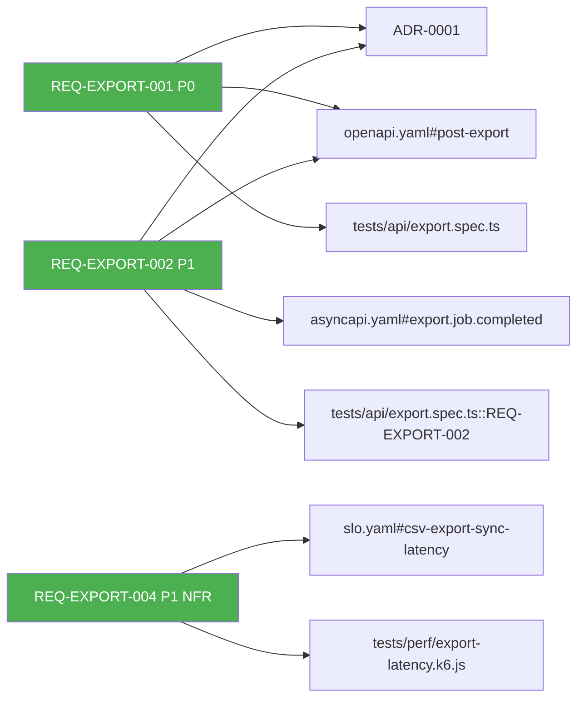

# 06. Traceability и CI-валидация

> **Аудитория:** Dev / Tech Lead.
> **Время:** 12 минут.
> **Предыдущий:** [05-l4-spec-cascade.md](./05-l4-spec-cascade.md) | **Следующий:** [07-profiles-and-risk.md](./07-profiles-and-risk.md)

---

## TL;DR

Traceability — это **обещание**, что каждое требование (REQ-ID) подкреплено хотя бы одним
артефактом подтверждения: тестом, контрактом, ADR или SLO. SpecKit **проверяет это автоматически**
на каждом PR через `make check-trace`.

Цепочка: `REQ-ID` → `ADR` → `Contract` → `Test` → `SLO`.
Если разрыв в любом звене — PR не вмёрджится.

---

## Зачем вообще traceability

Без неё через 6 месяцев эксплуатации возникают вопросы:

- «Этот эндпойнт `POST /export` — кто его заказывал? Можно убрать?»
- «У нас падает SLO `api-latency` — какое требование нарушено?»
- «Аудитор спросил, как мы покрыли REQ-AUDIT-003 — не помню, чем подтверждал».

С traceability на каждый из этих вопросов есть однозначный ответ за 30 секунд через `trace.md` или
`evidence/INIT-*-evidence-report.md`.

---

## Анатомия одной строки `trace.md`

```markdown
| REQ-EXPORT-001 | INIT-2026-099-ADR-0001-sync-vs-async | contracts/openapi.yaml#/paths/~1export/post | tests/api/export.spec.ts::REQ-EXPORT-001 | — |
```

Что эта строка обещает:
- **REQ-EXPORT-001** существует в `requirements.yml` (`make validate` это уже подтвердил).
- Архитектурное обоснование — в **ADR-0001** (sync vs async).
- Реализация описана в **OpenAPI** — конкретный path и method (через JSON Pointer `~1export/post`).
- Поведение проверяется **тестом** `export.spec.ts::REQ-EXPORT-001`.
- SLO для этого требования нет (`—`).

Если хоть одна ссылка протухла — `make check-trace` упадёт.

---

## Что именно проверяет CI

| Чек | Команда | Что валидирует | Когда блокирует |
|---|---|---|---|
| Schema | `make validate` | `requirements.yml` соответствует JSON Schema | Всегда |
| Contracts | `make lint-contracts` | OpenAPI 3.1 + AsyncAPI 3.0 синтаксис | Всегда |
| Breaking | `oasdiff` (CI) | Нет breaking changes vs main | Всегда |
| Trace L3↔L4 | `make check-trace` | REQ-IDs в `requirements.yml` ↔ `trace.md` | Всегда |
| Spec quality | `make check-spec-quality` | Нет open `NEEDS CLARIFICATION`, нет `{…}` | Всегда |
| Spec structure | `make check-spec-structure` | Canonical sections в spec/plan/tasks | Всегда |
| Release rollout | `make check-release-rollout` | `delivery/rollout.md` ↔ `ops/slo.yaml` ↔ `ops/prr-checklist.md` | Перед release |
| Markdown lint | `make lint-docs` | markdownlint правила | Warning → blocking через 2 недели |

Полный список — в [`Makefile`](../../Makefile) (`make help`).

---

## Worked example — ломаем и чиним trace

Откроем `examples/INIT-2026-099-csv-export/requirements.yml`. У `REQ-EXPORT-001` есть ссылки:

```yaml
trace:
  contracts:
    - "contracts/openapi.yaml#/paths/~1export/post"
  tests:
    - "tests/api/export.spec.ts::REQ-EXPORT-001"
```

### Сценарий «случайно переименовали REQ-ID»

Допустим, я через replace-all переименовал `REQ-EXPORT-001 → REQ-EXP-001` в `requirements.yml`,
но забыл обновить `trace.md` в L4 spec.

```bash
make check-trace
# ❌ FAIL
# trace.md references REQ-EXPORT-001, but requirements.yml has no such ID.
# trace.md references unknown ID at line 12.
```

**Фикс:** либо вернуть имя в `requirements.yml`, либо обновить `trace.md`. **Никогда** не игнорируй
этот чек — обычно он ловит реальный bug.

### Сценарий «удалили эндпойнт из OpenAPI»

Я зачистил `paths: /export` в `contracts/openapi.yaml`, но `requirements.yml` ещё ссылается на него.

```bash
make check-trace
# ❌ FAIL
# REQ-EXPORT-001 references contracts/openapi.yaml#/paths/~1export/post,
# but path /export does not exist in OpenAPI.
```

**Фикс:** если эндпойнт убрали намеренно — пометить REQ-EXPORT-001 как `status: deprecated`
и обновить trace. Если удалили случайно — вернуть в OpenAPI.

### Сценарий «забыли тест на новое требование»

Создал `REQ-EXPORT-006: column header localization`, но `trace.tests` пустой.

```bash
make check-trace
# ⚠️ WARNING (не blocking, но видно в evidence-report):
# REQ-EXPORT-006 has no tests in trace. Standard profile recommends >= 1 test.
```

**Фикс:** написать тест, добавить ссылку в `trace.tests`. Standard-профиль не блокирует на этом,
но `evidence/INIT-*-evidence-report.md` покажет gap.

---

## Как читать `trace.md`

Структура файла (генерируется автоматически через `/speckit-rtm` для L3 или `/speckit-trace` для L4):

```markdown
# RTM: INIT-2026-099-csv-export

| REQ-ID | Priority | Status | ADR | Contracts | Schemas | Tests | SLO |
|---|---|---|---|---|---|---|---|
| REQ-EXPORT-001 | P0 | proposed | ADR-0001 | openapi.yaml#... | — | export.spec.ts::REQ-EXPORT-001 | — |
| REQ-EXPORT-002 | P1 | proposed | ADR-0001 | openapi.yaml#..., asyncapi.yaml#... | export-job.schema.json | export.spec.ts::REQ-EXPORT-002 | — |
| REQ-EXPORT-004 | P1 | proposed | — | — | — | export-latency.k6.js::REQ-EXPORT-004 | slo.yaml#csv-export-sync-latency |

## Coverage summary
- Total REQ-IDs: 5
- With tests: 5/5 (100%)
- With contracts: 4/5 (80%)
- With SLO: 1/5 (20% — only NFR требования)
- BLOCKING gaps: 0
```

**На что смотреть в первую очередь:**
1. **Coverage with tests** — для P0 требований должно быть 100%.
2. **BLOCKING gaps** — если > 0, релиз блокируется.
3. **Orphan IDs** — REQ-IDs без ни одной ссылки. Это либо забыли, либо требование не нужно.

---

## Визуализация трассировки

Если RTM-таблица большая (50+ требований), читать неудобно. Используй визуализацию:

```text
/speckit-trace-viz INIT-2026-099-csv-export
```

Сгенерирует `trace-viz.md` с Mermaid-графом:



**Цветовая семантика skill'а `/speckit-trace-viz`:**

| Цвет | Что значит |
|---|---|
| 🟢 `#4CAF50` (green) | REQ-ID имеет ≥1 test link **И** ≥1 contract/component link — полное покрытие |
| 🟡 `#FFC107` (yellow) | REQ-ID имеет какие-то trace links, но coverage неполная |
| 🔴 `#f44336` (red) | REQ-ID не имеет ни одной trace ссылки — orphan, кандидат на удаление или фикс |

Источник истины: [`speckit-trace-viz.md`](../../.claude/commands/speckit-trace-viz.md).

---

## Evidence report — финальная сводка

Перед релизом:

```text
/speckit-evidence INIT-2026-099-csv-export
```

Генерирует `evidence/INIT-2026-099-csv-export-evidence-report.md`:

```markdown
# Evidence Report — INIT-2026-099-csv-export
**Generated:** 2026-04-28
**Profile:** standard
**Release readiness:** AMBER

## RTM coverage
- Total: 5 requirements
- With tests: 5/5 (100%)
- With contracts: 4/5 (80%)
- BLOCKING gaps: 0

## PRR status
- P0 done: 14/14 ✅
- P1 done: 8/10 (2 amber: runbook draft, drill pending)

## SLO
- csv-export-sync-latency: defined, instrumented ✅
- csv-export-availability: defined, instrumented ✅

## Recommendation
READY FOR CANARY (all P0 closed, 2 P1 deferred to post-GA — acceptable per ops/prr-checklist.md)
```

Это финальный gate перед `make check-release-rollout`.

---

## Цена и польза

**Стоимость:** 5-10% дополнительного времени на каждую задачу — поддержание ссылок в `trace`.

**Выгода:**
- Onboarding нового разработчика: «открой trace.md → увидишь всю картину» — ~ -3 дней времени тимлида на объяснения.
- Compliance аудит: 2 часа вместо 2 недель — генерируем evidence report одной командой.
- Debug инцидента: «у нас упало REQ-EXPORT-004 — открываем trace, видим SLO + ADR + тест → понимаем impact» — ~ -50% MTTR.

> **💡 Для тимлида.** Внедрять traceability «постфактум» на старую инициативу — пытка.
> Внедрять с первого дня — естественно. Поэтому имеет смысл начать с одной новой L3-инициативы
> и накатить на 100%, а старые подтянуть лениво по мере касания.

---

**Дальше:** [07-profiles-and-risk.md](./07-profiles-and-risk.md) — как выбрать правильный профиль, не overengineering и не недо-engineering.
