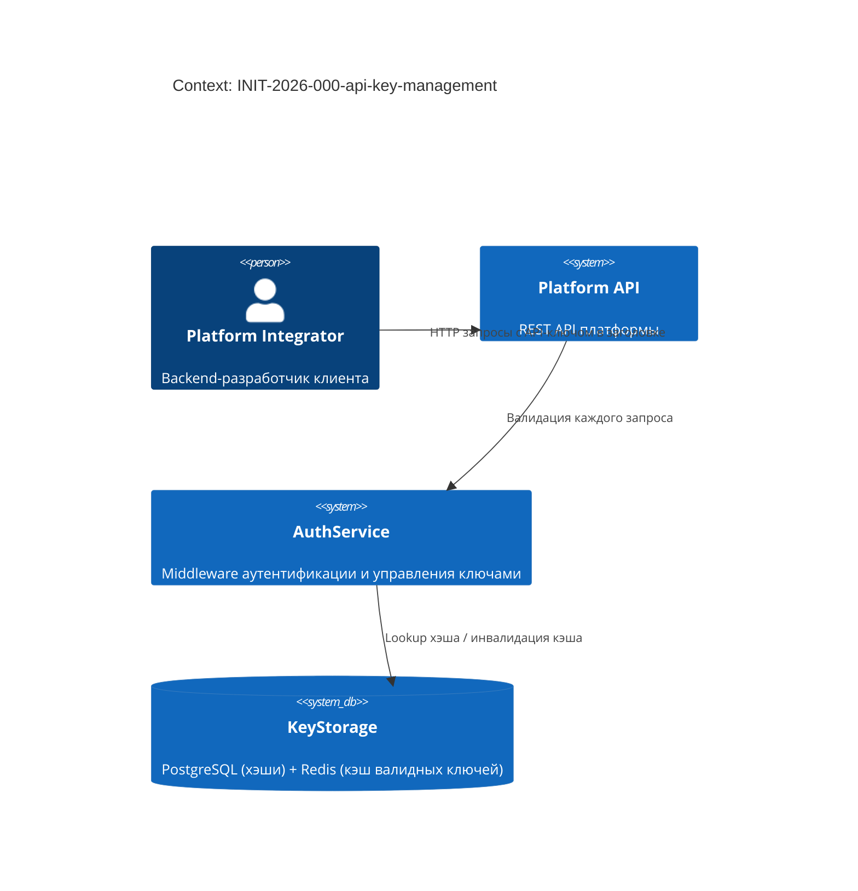
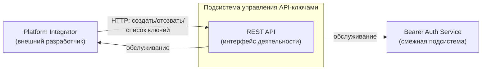
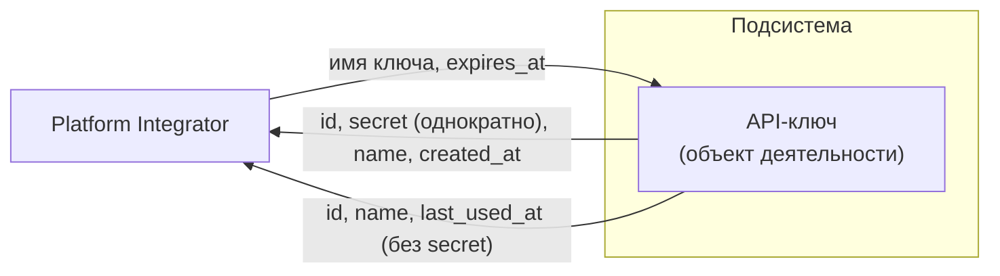
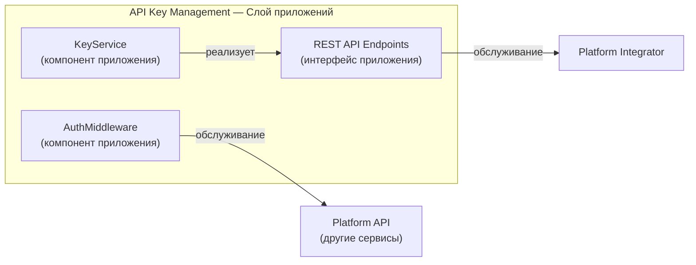
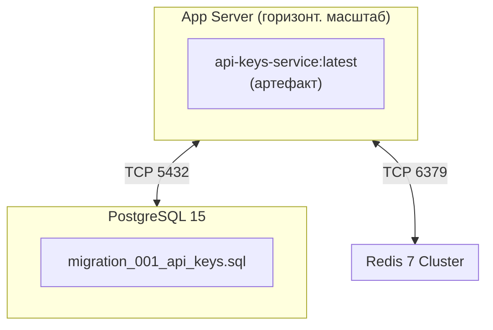

<!-- FILE: design.md -->
# Design: INIT-2026-000-api-key-management

**Owner (Tech Lead):** @platform-team
**Profile:** Standard
**Last updated:** 2026-03-01
**Related:** `prd.md`, `requirements.yml`, `decisions/`, `contracts/`, `ops/`

---

## Цели и ограничения

- **Goals:**
  1. Обеспечить программную аутентификацию без сессионных токенов для enterprise-интеграций
  2. Хранить секреты ключей безопасно — без возможности восстановления при компрометации БД
  3. Обеспечить P95 задержку аутентификации < 10ms при стандартной нагрузке 1000 req/s
- **Constraints (MUST):**
  - Обратная совместимость с существующей Bearer-аутентификацией — нулевые breaking changes в auth-middleware
  - Секрет API-ключа не хранится в открытом виде нигде в системе
  - Отзыв ключа должен распространиться на все узлы в течение 60 секунд

## Контекст и границы (C4: Context)

- **Системы и акторы:** Platform Integrator (внешний разработчик), Platform API (наш REST API), AuthService (middleware аутентификации), KeyStorage (PostgreSQL + Redis-кэш)
- **Trust boundaries:** Внешние запросы с API-ключами пересекают публичную границу; хэши хранятся только во внутренней БД



## Архитектурная стратегия

- **Основной подход:** Синхронный REST API с кэшированием валидации в Redis
- **Почему:** Простота — не требует event-driven архитектуры; кэш Redis даёт нужный P95 < 10ms; bcrypt-хэш при хранении даёт защиту от компрометации БД → `decisions/INIT-2026-000-ADR-0001-storage.md`

## Архитектурные слои (онтология АИС)

> Словарь: `domains/is-ontology/glossary.md` · Модель: `domains/is-ontology/canonical-model/model.md`

**Классификация подсистемы:**

| Параметр | Значение |
|----------|----------|
| Масштаб системы | `С.М.М` (малый, < 10M LOC) |
| Тип подсистемы | `ПС.Т.П` (прикладная — решает задачи аутентификации) |
| Вид деятельности | Управление доступом / API-аутентификация |
| Владелец | `@platform-team` |

### Слой деятельности (жёлтый)

| Элемент | Тип элемента | Описание |
|---------|-------------|----------|
| `Platform Integrator` | Участник деятельности | Внешний разработчик, выполняющий интеграцию с платформой |
| `REST API (публичный)` | Интерфейс деятельности | HTTP-интерфейс, через который интегратор создаёт, отзывает и перечисляет ключи |
| `Создание API-ключа` | Процесс деятельности | Генерация именованного ключа с возвратом секрета единственный раз |
| `Отзыв API-ключа` | Процесс деятельности | Немедленная инвалидация ключа с распространением < 60s |
| `Аутентификация по API-ключу` | Функция | Валидация входящего запроса по API-ключу в заголовке |
| `API-ключ` | Объект деятельности | Долгосрочный credential для headless-интеграций (id, name, expires_at) |

### Слой приложений (бирюзовый)

| Элемент | Тип элемента | Описание |
|---------|-------------|----------|
| `KeyService` | Компонент приложения | CRUD-операции с ключами: создание, отзыв, листинг |
| `AuthMiddleware` | Компонент приложения | Валидация API-ключа на каждый входящий запрос |
| `REST API Endpoints` | Интерфейс приложения | `POST /api-keys`, `GET /api-keys`, `DELETE /api-keys/{id}` |
| `ApiKey` | Объект данных | Схема ключа: `contracts/schemas/api-key.schema.json` |

### Технологический слой (зелёный)

| Элемент | Тип элемента | Описание |
|---------|-------------|----------|
| `App Server` | Узел | Горизонтально масштабируемые stateless-серверы приложения |
| `PostgreSQL` | Узел | БД для долгосрочного хранения bcrypt-хэшей |
| `Redis Cluster` | Узел | Кэш валидных ключей с TTL 60s |
| `PostgreSQL 15` | Системное ПО | СУБД с поддержкой UUID, индексы на user_id |
| `Redis 7` | Системное ПО | In-memory хранилище с TTL и паттерном keyspace-уведомлений |
| `api-keys-service:latest` | Артефакт | Docker-образ KeyService + AuthMiddleware |
| `migration_001_api_keys.sql` | Артефакт | Миграция БД: таблица `api_keys` + индекс |

---

## Архитектурные представления

| Тип | Статус |
|-----|--------|
| Д-1: Внешнее взаимодействие деятельности | заполнено |
| Д-3: Внешние потоки данных деятельности | заполнено |
| П-1: Внешнее взаимодействие подсистемы | заполнено |
| Т-1: Схема типов и связей узлов | заполнено |

### Д-1: Внешнее взаимодействие деятельности

_Кто взаимодействует с подсистемой API Key Management и через какие интерфейсы?_



### Д-3: Внешние потоки данных деятельности

_Какие данные поступают в подсистему и какие выходят наружу?_



### П-1: Внешнее взаимодействие подсистемы

_Как подсистема взаимодействует с внешними системами и потребителями на уровне ПО?_



### Т-1: Схема типов и связей узлов

_Какая инфраструктура используется и как она соединена?_



---

## Ключевые строительные блоки (C4: Container)

| Контейнер | Ответственность | Данные | Масштабирование | Риски |
|---|---|---|---|---|
| `AuthMiddleware` | Валидирует API-ключ в заголовке каждого запроса | Читает хэш из Redis-кэша (TTL 60s), fallback в PostgreSQL | Горизонтальное (stateless) | Cache stampede при инвалидации |
| `KeyService` | CRUD операции: create, list, revoke | Пишет в PostgreSQL, инвалидирует Redis | Горизонтальное | — |
| `KeyStorage (PostgreSQL)` | Долгосрочное хранение хэшей ключей | Таблица `api_keys`: id, name, secret_hash, user_id, created_at, expires_at, last_used_at | Вертикальное + read replicas | Нет plaintext — нельзя восстановить потерянный ключ |
| `KeyCache (Redis)` | Кэш валидных key-хэшей для fast-path аутентификации | TTL 60s per key; явная инвалидация при revoke | Горизонтальное (cluster) | 60s window при компрометации до инвалидации |

## Контракты и данные

- **OpenAPI:** `contracts/openapi.yaml` — пути GET /api-keys, POST /api-keys, DELETE /api-keys/{id}
- **AsyncAPI:** не используется (sync-only)
- **JSON Schema:** `contracts/schemas/api-key.schema.json` — схема объекта ApiKey (без secret)

**Схема таблицы `api_keys`:**
```sql
CREATE TABLE api_keys (
  id          UUID PRIMARY KEY DEFAULT gen_random_uuid(),
  user_id     UUID NOT NULL REFERENCES users(id) ON DELETE CASCADE,
  name        TEXT NOT NULL,
  secret_hash TEXT NOT NULL,  -- bcrypt work_factor=10
  created_at  TIMESTAMPTZ NOT NULL DEFAULT now(),
  expires_at  TIMESTAMPTZ,
  last_used_at TIMESTAMPTZ
);
CREATE INDEX api_keys_user_id_idx ON api_keys(user_id);
```

## Качество и NFR (quality scenarios)

- **Performance:** P95 задержка аутентификации < 10ms при cache hit (Redis); P95 < 50ms при cache miss (PostgreSQL lookup) → `REQ-AUTH-004`
- **Reliability:** SLO 99.9% availability → `ops/slo.yaml#api-key-auth-latency`
- **Revocation propagation:** Явная инвалидация Redis-ключа при DELETE + TTL 60s как fallback гарантирует распространение < 60s → `REQ-AUTH-002`
- **Security:** bcrypt work_factor=10; секрет никогда не логируется и не возвращается повторно → `decisions/INIT-2026-000-ADR-0001-storage.md`

## Развёртывание и миграции

- **Rollout strategy:** `delivery/rollout.md` — feature-flag → canary 5% → production
- **Data migration:** Новая таблица `api_keys` (аддитивная, нет breaking changes); миграция через стандартный pipeline

## Открытые вопросы

- Все вопросы закрыты до начала реализации (см. `.specify/specs/000-api-key-management/spec.md#open-questions`)
