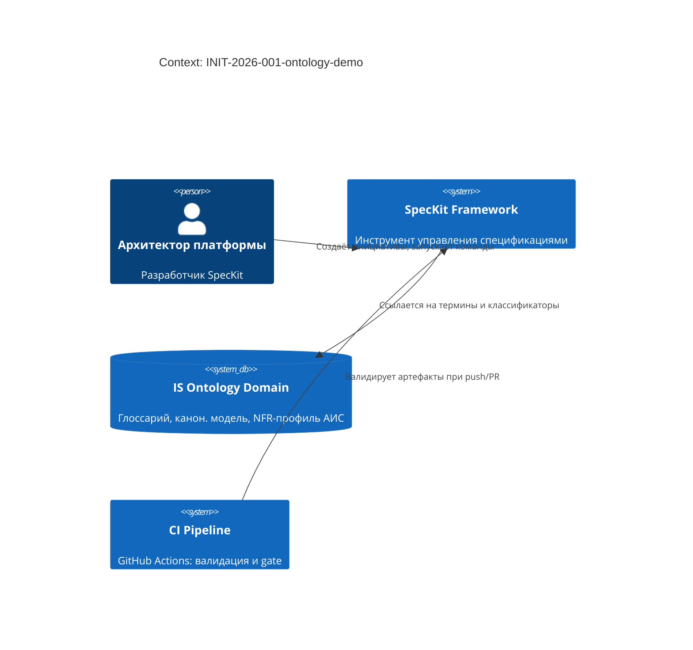
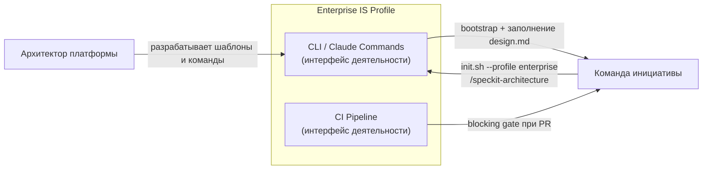
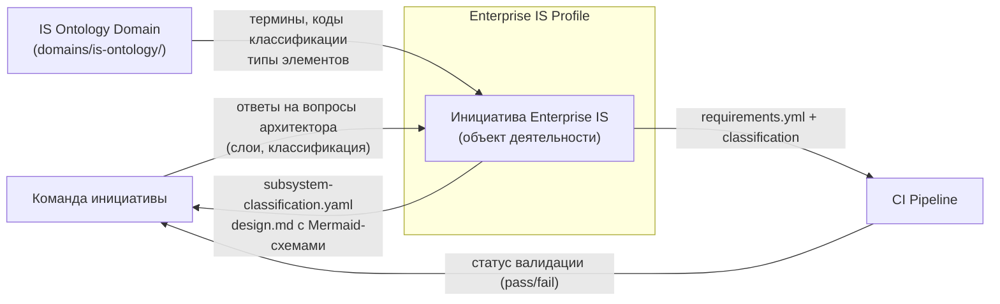
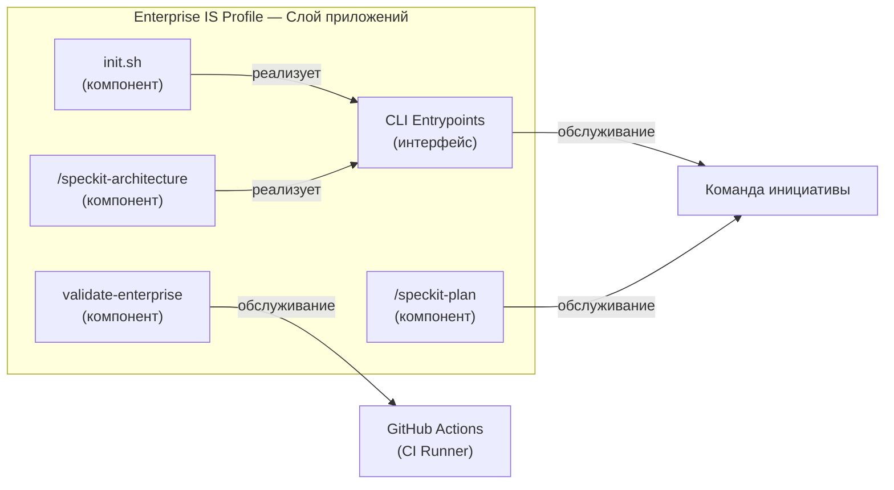
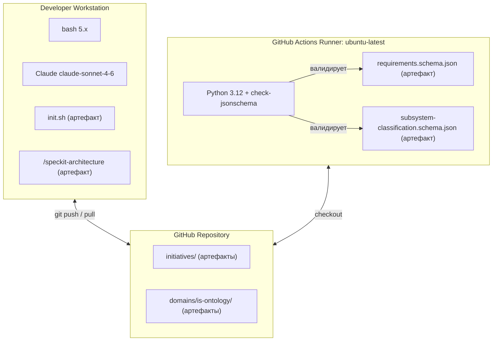

<!-- FILE: design.md -->
# Design: INIT-2026-001-ontology-demo

**Owner (Tech Lead):** @platform-team
**Profile:** Enterprise
**Last updated:** 2026-03-03
**Related:** `requirements.yml`, `subsystem-classification.yaml`, `architecture-views/`

---

## Цели и ограничения

- **Goals:**
  1. Продемонстрировать полный цикл Enterprise IS Profile в SpecKit: трёхслойная архитектура + machine-readable классификация + CI-валидация
  2. Предоставить эталонный пример для команд, переходящих на profile=enterprise
- **Constraints (MUST):**
  - Все новые артефакты обратно совместимы с существующими Minimal/Standard/Extended инициативами
  - Онтологические термины строго соответствуют `domains/is-ontology/glossary.md`

## Контекст и границы (C4: Context)

- **Системы и акторы:** Platform Team (разработчики SpecKit), SpecKit Framework (инструмент), IS Ontology Domain (домен знаний АИС), CI Pipeline (GitHub Actions)
- **Trust boundaries:** Онтологические артефакты — только чтение из `domains/`; CI имеет доступ только к репозиторию

## Архитектурная стратегия

- **Основной подход:** Декларативные YAML/Markdown артефакты + JSON Schema CI-валидация
- **Почему:** Лёгкость интеграции в существующий SpecKit без кодовых зависимостей; CI как единственный enforcement-механизм → `decisions/PLAT-0002-is-ontology-integration`

## Архитектурные слои (онтология АИС)

> Словарь: `domains/is-ontology/glossary.md` · Модель: `domains/is-ontology/canonical-model/model.md`

**Классификация подсистемы:**

| Параметр | Значение |
|----------|----------|
| Масштаб системы | `С.М.С` (средняя, 10–100M LOC) |
| Тип подсистемы | `ПС.Т.ПТ` (программно-технологическая — инструмент разработки) |
| Вид деятельности | Управление спецификациями / Архитектурная документация |
| Владелец | `@platform-team` |

### Слой деятельности (жёлтый)

| Элемент | Тип элемента | Описание |
|---------|-------------|----------|
| `Архитектор платформы` | Участник деятельности | Разработчик SpecKit, внедряющий онтологию АИС |
| `Команда инициативы` | Участник деятельности | Команда, использующая Enterprise IS Profile |
| `CLI / Claude Commands` | Интерфейс деятельности | Точки входа: /speckit-architecture, init.sh --profile enterprise |
| `CI Pipeline` | Интерфейс деятельности | GitHub Actions — автоматическая валидация при push/PR |
| `Создание Enterprise инициативы` | Процесс деятельности | Bootstrap артефактов: requirements.yml + subsystem-classification.yaml + architecture-views/ |
| `Архитектурное описание` | Процесс деятельности | Заполнение трёх слоёв design.md и генерация Mermaid-схем |
| `CI-валидация Enterprise` | Функция | Проверка наличия и валидности subsystem-classification.yaml |
| `Инициатива Enterprise IS` | Объект деятельности | Пакет артефактов: requirements.yml, design.md, subsystem-classification.yaml, architecture-views/ |

### Слой приложений (бирюзовый)

| Элемент | Тип элемента | Описание |
|---------|-------------|----------|
| `init.sh` | Компонент приложения | Bootstrap-скрипт; флаг --profile enterprise создаёт Enterprise-артефакты |
| `/speckit-architecture` | Компонент приложения | Claude-команда: интерактивный мастер трёх слоёв + генерация Mermaid |
| `/speckit-plan` | Компонент приложения | Claude-команда: проверка наличия трёхслойного design.md и subsystem-classification.yaml |
| `validate-enterprise` | Компонент приложения | CI job: блокирует PR при отсутствии/невалидности subsystem-classification.yaml |
| `CLI Entrypoints` | Интерфейс приложения | `./tools/init.sh INIT-YYYY-NNN --profile enterprise`, `/speckit-architecture INIT-...` |
| `subsystem-classification.yaml` | Объект данных | Схема: `tools/schemas/subsystem-classification.schema.json` |
| `requirements.yml (Enterprise)` | Объект данных | Схема: `tools/schemas/requirements.schema.json` (includes classification, iso_characteristic) |

### Технологический слой (зелёный)

| Элемент | Тип элемента | Описание |
|---------|-------------|----------|
| `Developer Workstation` | Узел | Машина разработчика: запускает init.sh и /speckit-architecture |
| `GitHub Actions Runner` | Узел | ubuntu-latest: выполняет validate-enterprise job |
| `GitHub Repository` | Узел | Хранилище артефактов: initiatives/, domains/, tools/ |
| `bash 5.x` | Системное ПО | Среда выполнения init.sh |
| `Python 3.12 + check-jsonschema` | Системное ПО | Валидация YAML против JSON Schema в CI |
| `Claude claude-sonnet-4-6` | Системное ПО | LLM-среда для /speckit-architecture и /speckit-plan |
| `subsystem-classification.schema.json` | Артефакт | JSON Schema Draft 2020-12 для валидации classification-файла |
| `requirements.schema.json (расширенная)` | Артефакт | JSON Schema с classification, iso_characteristic, architecture_views |

---

## Архитектурные представления

| Тип | Статус |
|-----|--------|
| Д-1: Внешнее взаимодействие деятельности | заполнено |
| Д-2: Внутреннее взаимодействие деятельности | н/п |
| Д-3: Внешние потоки данных деятельности | заполнено |
| Д-4а: Процесс деятельности — Контекст | н/п |
| Д-4б: Процесс деятельности — Состав | н/п |
| Д-5: Внутренние потоки данных | н/п |
| Д-6: Функциональная карта | н/п |
| П-1: Внешнее взаимодействие подсистемы | заполнено |
| П-2: Внутреннее взаимодействие компонентов | н/п |
| Т-1: Схема типов и связей узлов | заполнено |
| О-1: Схема связи слоёв | н/п |

### Д-1: Внешнее взаимодействие деятельности

_Кто взаимодействует с Enterprise IS Profile и через какие интерфейсы?_

### Д-3: Внешние потоки данных деятельности

_Какие данные поступают в подсистему и выходят наружу?_

### П-1: Внешнее взаимодействие подсистемы

_Как компоненты Enterprise IS Profile взаимодействуют с внешними системами?_

### Т-1: Схема типов и связей узлов

_Какая инфраструктура используется и как она соединена?_

---

## Ключевые строительные блоки (C4: Container)

| Контейнер | Ответственность | Данные | Масштабирование | Риски |
|---|---|---|---|---|
| `init.sh` | Bootstrap Enterprise-структуры при создании инициативы | Пишет шаблонные YAML/MD файлы | n/a (скрипт) | Неверно заполненный шаблон требует ручной правки |
| `/speckit-architecture` | Интерактивный сбор данных о трёх слоях + генерация Mermaid | Читает prd.md, design.md; пишет секции design.md + subsystem-classification.yaml | n/a (Claude session) | Качество схем зависит от полноты ответов архитектора |
| `validate-enterprise` | CI gate для Enterprise профиля | Читает requirements.yml + subsystem-classification.yaml | Параллельно с другими jobs | Ложные блокировки при невалидных кодах классификации |
| `subsystem-classification.schema.json` | JSON Schema для machine-readable классификации | Schema только для чтения | n/a | Изменения enum требуют migration существующих файлов |

## Контракты и данные

- **JSON Schema:** `tools/schemas/requirements.schema.json` — расширена: classification, iso_characteristic, type quality
- **JSON Schema:** `tools/schemas/subsystem-classification.schema.json` — новая: classification codes + architecture_views

## Качество и NFR

- **Performance:** CI validate-enterprise < 30s → `REQ-PLAT-003`
- **Compatibility:** 100% pass rate на существующих initiatives → `REQ-PLAT-004`
- **Security:** нет чувствительных данных в артефактах

## Развёртывание и миграции

- **Rollout:** Новые файлы добавляются без breaking changes; профиль enterprise активируется опционально
- **Существующие инициативы:** Не затронуты (все новые поля optional)

## Открытые вопросы

- Все вопросы закрыты. Эта инициатива — демонстрационная.
