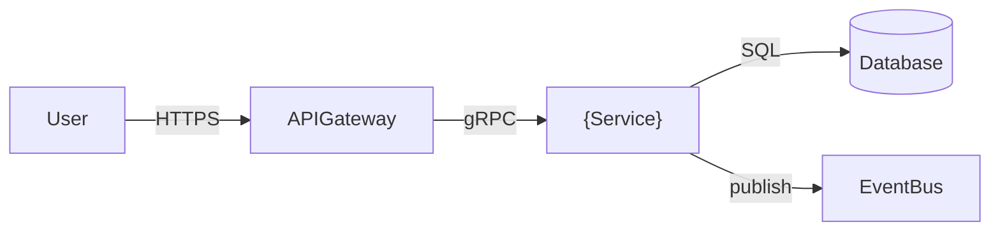

# Threat Model: INIT-2026-002-notification-preferences

**Профиль:** Extended
**Методология:** STRIDE
**Последнее обновление:** 2026-04-10
**Ревьюер:** @{security}

## Границы доверия и активы

| Актив | Классификация | Владелец |
|---|---|---|
| `{data-type}` | {public\|internal\|confidential\|restricted} | @{owner} |

## Data Flow Diagram (DFD)

## STRIDE-анализ угроз

| ID | Угроза (STRIDE) | Компонент | Вероятность | Воздействие | Митигация | Статус |
|---|---|---|---|---|---|---|
| T01 | Spoofing — подделка identity | APIGateway | Medium | High | JWT + mTLS | {open\|mitigated} |
| T02 | Tampering — изменение данных в transit | {Service} → DB | Low | High | TLS 1.3 + encryption at rest | {open\|mitigated} |
| T03 | Repudiation — отрицание действий | {Service} | Medium | Medium | Audit log с trace_id | {open\|mitigated} |
| T04 | Information Disclosure — утечка данных | DB | Low | Critical | Row-level security + column masking | {open\|mitigated} |
| T05 | Denial of Service | APIGateway | High | High | Rate limiting + circuit breaker | {open\|mitigated} |
| T06 | Elevation of Privilege | {Service} | Low | Critical | Least privilege + RBAC | {open\|mitigated} |

## Итог и риски

| Риск | Уровень | Решение |
|---|---|---|
| {Risk} | {Critical\|High\|Medium\|Low} | {Mitigation} |
