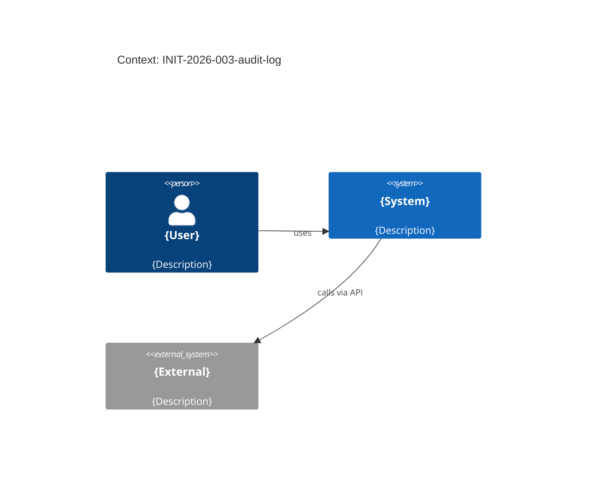
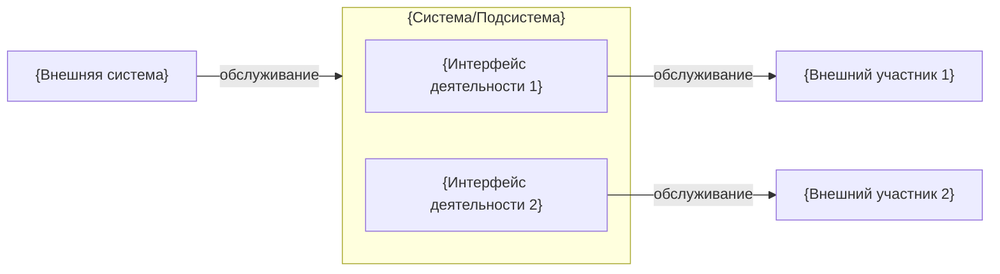
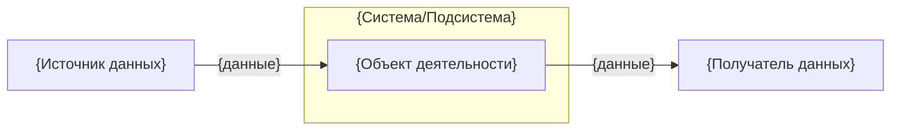
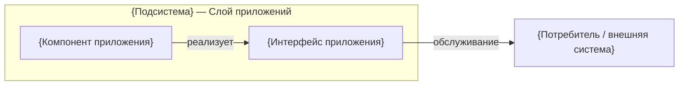
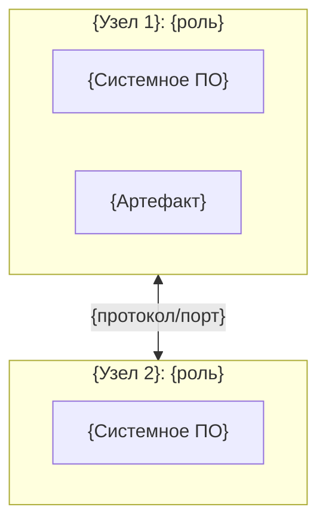

<!-- FILE: design.md -->
# Design: INIT-2026-003-audit-log

**Owner (Tech Lead):** @{team-or-person}
**Profile:** {Minimal|Standard|Extended}
**Last updated:** 2026-04-10
**HLD:** `hld.md` (если есть — архитектура верхнего уровня)
**Related:** `prd.md`, `requirements.yml`, `decisions/`, `contracts/`, `ops/`

---

## Цели и ограничения

- **Goals:**
  1. {Goal 1}
  2. {Goal 2}
- **Constraints (MUST):** {регуляторика / latency / SLA / технологии / …}

## Контекст и границы (C4: Context)

> Если `hld.md` существует, C4 Context и Container описаны там. Здесь — только implementation-level детали.

- **Системы и акторы:** {список → или ссылка на hld.md §2}
- **Trust boundaries** (Extended): {кратко}

## Архитектурная стратегия

- **Основной подход:** {async jobs | event-driven | sync API | …}
- **Почему:** {decision drivers → `decisions/{INIT}-ADR-0001-{slug}.md`}

## Архитектурные слои (онтология АИС)

> Раздел заполняется при profile=enterprise или когда требуется описание по методологии АИС.
> Словарь: `domains/is-ontology/glossary.md` · Модель: `domains/is-ontology/canonical-model/model.md`

**Классификация подсистемы:**

| Параметр | Значение |
|----------|----------|
| Масштаб системы | `{С.М.М < 10M LOC \| С.М.С 10–100M LOC \| С.М.Б > 100M LOC}` |
| Тип подсистемы | `{ПС.Т.И — инфраструктурная \| ПС.Т.ПТ — программно-технологическая \| ПС.Т.П — прикладная}` |
| Вид деятельности | `{предметная область}` |
| Владелец | `@{team}` |

### Слой деятельности (жёлтый)

_Бизнес-процессы, участники, события, объекты деятельности._

| Элемент | Тип элемента | Описание |
|---------|-------------|----------|
| `{Участник деятельности}` | Участник деятельности | {Роль или организация, участвующая в процессе} |
| `{Интерфейс деятельности}` | Интерфейс деятельности | {Канал взаимодействия: веб, API, файловый обмен} |
| `{Процесс деятельности}` | Процесс деятельности | {Бизнес-процесс, реализуемый подсистемой} |
| `{Функция}` | Функция | {Функция, выполняемая определённой ролью} |
| `{Событие деятельности}` | Событие деятельности | {Бизнес-событие, запускающее или результирующее процесс} |
| `{Объект деятельности}` | Объект деятельности | {Бизнес-объект, документ или информация} |

### Слой приложений (бирюзовый)

_Компоненты ПО, интерфейсы приложений, объекты данных._

| Элемент | Тип элемента | Описание |
|---------|-------------|----------|
| `{Компонент приложения}` | Компонент приложения | {Инкапсулированный программный компонент} |
| `{Комплекс приложений}` | Комплекс приложений | {Совокупность компонентов, работающих вместе} |
| `{Интерфейс приложения}` | Интерфейс приложения | {REST API / gRPC / очередь — точка доступа} |
| `{Объект данных}` | Объект данных | {Схема данных, модель: `contracts/schemas/*.json`} |

### Технологический слой (зелёный)

_Узлы развёртывания, системное ПО, артефакты._

| Элемент | Тип элемента | Описание |
|---------|-------------|----------|
| `{Узел}` | Узел | {Сервер / ВМ / Kubernetes Pod / облачный сервис} |
| `{Системное ПО}` | Системное ПО | {СУБД, брокер сообщений, ОС, контейнер runtime} |
| `{Артефакт}` | Артефакт | {Docker-образ, JAR, конфиг, миграция БД} |

---

## Архитектурные представления

> Заполняйте только необходимые представления. Описание всех 11 типов: `domains/is-ontology/canonical-model/model.md#3-типы-архитектурных-представлений`.

| Тип | Обязательность | Статус |
|-----|---------------|--------|
| Д-1: Внешнее взаимодействие деятельности | Стандарт+ | `{заполнено \| н/п}` |
| Д-2: Внутреннее взаимодействие деятельности | Enterprise | `{заполнено \| н/п}` |
| Д-3: Внешние потоки данных деятельности | Стандарт+ | `{заполнено \| н/п}` |
| Д-4а: Процесс деятельности — Контекст | По потребности | `{заполнено \| н/п}` |
| Д-4б: Процесс деятельности — Состав | По потребности | `{заполнено \| н/п}` |
| Д-5: Внутренние потоки данных | Enterprise | `{заполнено \| н/п}` |
| Д-6: Функциональная карта | Стандарт+ | `{заполнено \| н/п}` |
| П-1: Внешнее взаимодействие подсистемы | Стандарт+ | `{заполнено \| н/п}` |
| П-2: Внутреннее взаимодействие компонентов | Стандарт+ | `{заполнено \| н/п}` |
| Т-1: Схема типов и связей узлов | Стандарт+ | `{заполнено \| н/п}` |
| О-1: Схема связи слоёв | Enterprise | `{заполнено \| н/п}` |

### Д-1: Внешнее взаимодействие деятельности

_Отвечает на вопросы: кто внешние участники? Какие интерфейсы предоставляются? Как взаимодействуют внешние системы?_

### Д-3: Внешние потоки данных деятельности

_Отвечает на вопросы: какие данные поступают извне? Какие данные уходят наружу?_

### П-1: Внешнее взаимодействие подсистемы

_Отвечает на вопросы: какие компоненты/интерфейсы предоставляет подсистема? Как взаимодействует с внешними системами на уровне ПО?_

### Т-1: Схема типов и связей узлов

_Отвечает на вопросы: какие типы узлов используются? Как они соединены? Какие артефакты размещены?_

> Дополнительные представления (Д-2, Д-4а, Д-4б, Д-5, Д-6, П-2, Т-2, О-1) добавляйте ниже по необходимости.

---

## Ключевые строительные блоки (C4: Container)

| Контейнер | Ответственность | Данные | Масштабирование | Риски |
|---|---|---|---|---|
| `{service}` | {…} | {…} | {horizontal/vertical} | {…} |

## Контракты и данные

- **OpenAPI:** `contracts/openapi.yaml`
- **AsyncAPI** (если есть): `contracts/asyncapi.yaml`
- **JSON Schema:** `contracts/schemas/*.json`

## Качество и NFR (quality scenarios)

- **Performance:** {цели → `REQ-{SCOPE}-{NNN}`}
- **Reliability:** {SLO → `ops/slo.yaml`}
- **Security/Privacy** (Extended): `ops/threat-model.md`

## Развёртывание и миграции

- **Rollout strategy:** `delivery/rollout.md`
- **Data migration:** `delivery/migration.md` (Extended)

## Открытые вопросы

- {Q1} (owner: @{name}, due: 2026-04-10)
- {Q2} (owner: @{name}, due: 2026-04-10)
