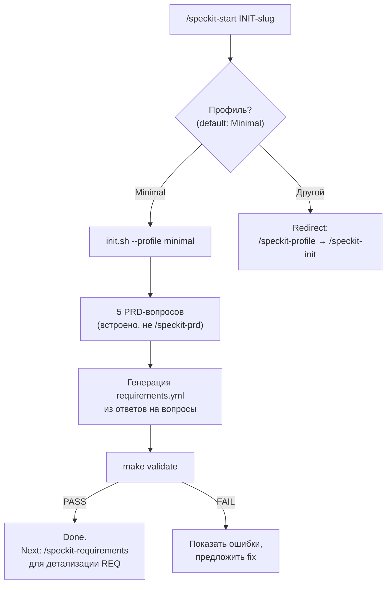
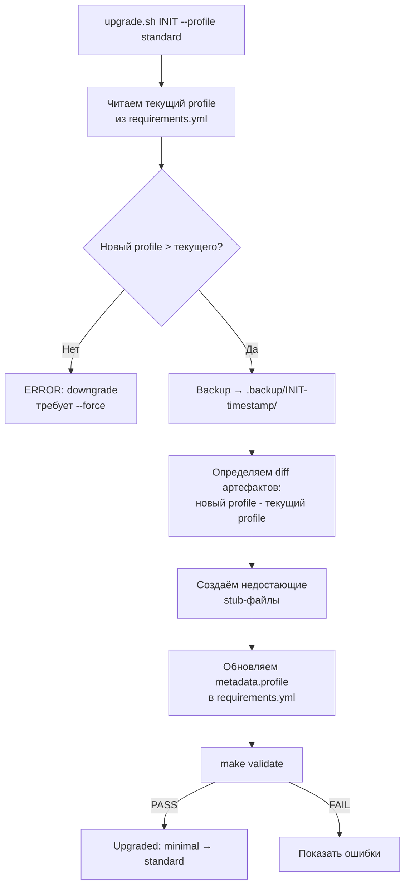
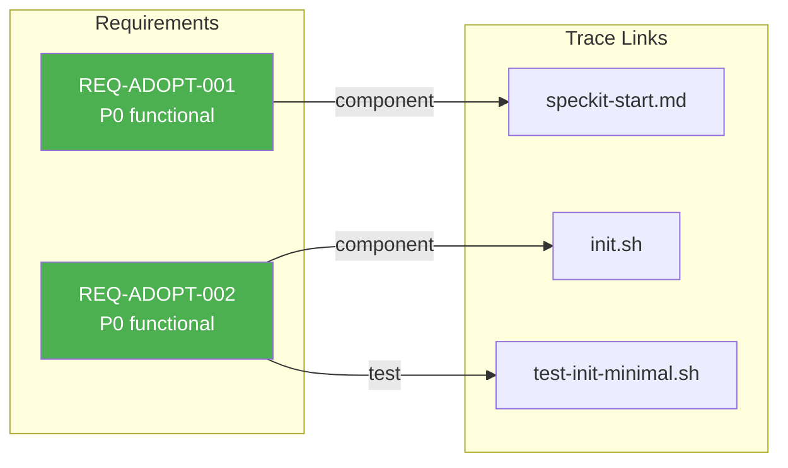

# Design: INIT-2026-004-adoption-path

**Owner (Tech Lead):** @karfev
**Profile:** Standard
**Last updated:** 2026-04-11
**Related:** `prd.md`, `requirements.yml`

---

## Цели и ограничения

- **Goals:**
  1. Снизить time-to-first-validate с ~120 минут до < 30 минут для нового пользователя
  2. Обеспечить progressive adoption: Minimal → Standard → Extended без потери артефактов
  3. Дать визуальный «aha-момент» для traceability через Mermaid-визуализацию
- **Constraints (MUST):**
  - Backward compatibility: existing инициативы (INIT-2026-000..003) продолжают проходить `make validate` без изменений
  - Никаких breaking changes в init.sh для профилей Standard/Extended/Enterprise
  - Clean Minimal scaffold не ломает CI pipeline (validate.yml)

## Контекст: что меняется

Adoption Path — это не новая подсистема, а набор изменений в tooling layer SpecKit. Затрагиваемые компоненты:

```text
Компонент                  Тип изменения         REQ
─────────────────────────  ────────────────────   ──────────────
tools/init.sh              Modify (Minimal flow)  REQ-ADOPT-002, REQ-ADOPT-006
tools/upgrade.sh           New script             REQ-ADOPT-003
.claude/commands/          New command (2)        REQ-ADOPT-001, REQ-ADOPT-005
docs/QUICKSTART.md         New document           REQ-ADOPT-004
README.md                  Modify (Quick Start)   REQ-ADOPT-004
```

## Архитектура изменений

### 1. `/speckit-start` — Unified Entry Command (REQ-ADOPT-001)

Новая Claude Code команда, которая оркестрирует существующие команды в guided flow.

**Flow:**



**Принцип:** `/speckit-start` НЕ дублирует логику `/speckit-prd` и `/speckit-requirements`. Он задаёт 5 упрощённых вопросов и генерирует минимальные stubs. Для полного заполнения пользователь переходит к стандартным командам.

**Вопросы /speckit-start (5 штук):**

1. **Slug:** Как назвать инициативу? (→ INIT-YYYY-NNN-slug)
2. **Problem:** Какую проблему решаем? Одно предложение. (→ prd.md: Проблема)
3. **Outcome:** Какой результат хотим? Одно предложение. (→ prd.md: Цель)
4. **Scope:** 2-4 пункта, что входит в scope. (→ prd.md: Scope + requirements.yml: REQ-IDs)
5. **Product:** К какому продукту относится? (→ metadata.product)

### 2. Clean Minimal Scaffold (REQ-ADOPT-002)

**Текущее поведение init.sh:**
```
initiatives/INIT-xxx/
  prd.md, requirements.yml, README.md, changelog/CHANGELOG.md
```

Для Minimal-профиля init.sh уже создаёт только 4 файла. Пустые директории удаляются
через `find "$TARGET_INIT" -type d -empty -delete`. **Требование уже выполнено.**

### 3. upgrade.sh — Profile Migration (REQ-ADOPT-003)

Новый скрипт `tools/upgrade.sh`. Логика:



**Матрица артефактов по профилям:**

| Артефакт | Minimal | Standard | Extended | Enterprise |
|---|:---:|:---:|:---:|:---:|
| prd.md | ✅ | ✅ | ✅ | ✅ |
| requirements.yml | ✅ | ✅ | ✅ | ✅ |
| README.md | ✅ | ✅ | ✅ | ✅ |
| changelog/CHANGELOG.md | ✅ | ✅ | ✅ | ✅ |
| design.md | — | ✅ | ✅ | ✅ |
| contracts/ | — | ✅ | ✅ | ✅ |
| decisions/ | — | ✅ | ✅ | ✅ |
| ops/slo.yaml | — | ✅ | ✅ | ✅ |
| ops/prr-checklist.md | — | ✅ | ✅ | ✅ |
| delivery/rollout.md | — | ✅ | ✅ | ✅ |
| trace.md | — | ✅ | ✅ | ✅ |
| ops/threat-model.md | — | — | ✅ | ✅ |
| ops/nfr-validation.md | — | — | ✅ | ✅ |
| delivery/migration.md | — | — | ✅ | ✅ |
| compliance/ | — | — | ✅ | ✅ |
| architecture-views/ | — | — | — | ✅ |
| subsystem-classification.yaml | — | — | — | ✅ |

upgrade.sh вычисляет diff между текущим и целевым набором и создаёт только недостающие файлы.

### 4. Quick Start (REQ-ADOPT-004)

**Формат:** docs/QUICKSTART.md, ≤ 60 строк.

**Структура:**
```
# SpecKit Quick Start (5 minutes)

## Prerequisites
- Node.js 18+, Python 3.10+

## Steps
1. Clone & install
2. /speckit-start (или ручной init.sh --profile minimal)
3. Заполнить prd.md
4. Заполнить requirements.yml
5. make validate
6. Done — your first spec-validated initiative

## What's next?
- Gate 2: contracts + traceability → README.md#gate-2
```

### 5. /speckit-trace-viz (REQ-ADOPT-005)

Команда читает requirements.yml инициативы и генерирует Mermaid-диаграмму:



Nodes без trace links подсвечиваются красным (orphans). Nodes со всеми линками — зелёные (covered).

### 6. Archkom Decoupling (REQ-ADOPT-006)

**Текущее поведение:** `brd.md` и `hld.md` — в массиве EXTENDED_ONLY. Enterprise-профиль их сохраняет. `--preset archkom` раскомментирует секции.

**Новое поведение:** Archkom — ортогональный axis. brd.md/hld.md доступны ТОЛЬКО через `--preset archkom`, для любого профиля Standard+.

```text
              Profile axis (глубина спецификации)
              ────────────────────────────────────→
              Minimal   Standard   Extended   Enterprise

Governance   │         │ Archkom доступен для Standard+  │
axis         │         │ BRD → PRD → HLD → ADR → design  │
(opt-in)     │         │                                   │
```

**Изменение в init.sh:** Убираем brd.md/hld.md из EXTENDED_ONLY. Добавляем ARCHKOM_ONLY. Удаляем archkom-файлы для всех профилей если --preset != archkom.

---

## Порядок реализации

| # | Задача | REQ | Effort | Зависимости |
|---|---|---|---|---|
| 1 | Clean Minimal scaffold в init.sh | REQ-ADOPT-002 | done | — |
| 2 | docs/QUICKSTART.md | REQ-ADOPT-004 | 0.5d | — |
| 3 | /speckit-start command | REQ-ADOPT-001 | 1-2d | — |
| 4 | upgrade.sh | REQ-ADOPT-003 | 2-3d | — |
| 5 | Archkom decoupling в init.sh | REQ-ADOPT-006 | 1d | — |
| 6 | /speckit-trace-viz command | REQ-ADOPT-005 | 1-2d | — |
| 7 | User testing Gate 1 | REQ-ADOPT-007 | 1d | #2, #3 |

**Critical path:** #3 → #7 (Start command → User testing)
