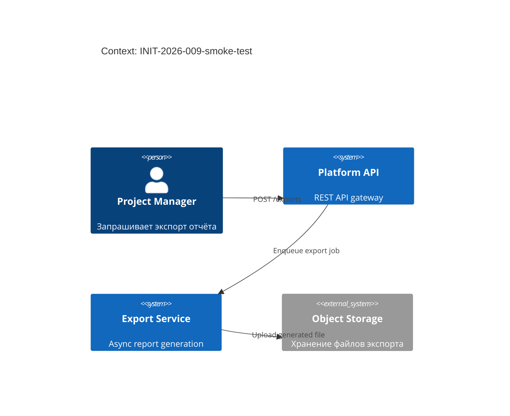

<!-- FILE: design.md -->
# Design: INIT-2026-009-smoke-test

**Owner (Tech Lead):** @smoke-tester
**Profile:** Standard
**Last updated:** 2026-04-12
**Related:** `prd.md`, `requirements.yml`, `decisions/`, `contracts/`, `ops/`

---

## Цели и ограничения

- **Goals:**
  1. {Предоставить REST API для экспорта проектных отчётов в JSON/CSV}
  2. {Обеспечить асинхронную генерацию с event-нотификацией}
- **Constraints (MUST):**
  - {P95 latency < 30s для экспорта проектов до 10K записей}
  - {Rate limiting: не более 10 concurrent exports на пользователя}

## Контекст и границы (C4: Context)

- **Системы и акторы:** {Project Manager (пользователь), Platform API (REST), Export Service (async worker), Object Storage (файлы), Message Broker (events)}
- **Trust boundaries:** {Внешние запросы через authenticated API; файлы хранятся во внутреннем storage}

## Архитектурная стратегия

- **Основной подход:** async jobs (queue-based)
- **Почему:** Экспорт может занять >10s для больших проектов — sync API не подходит

## Ключевые строительные блоки (C4: Container)

| Контейнер | Ответственность | Данные | Масштабирование | Риски |
|---|---|---|---|---|
| `export-service` | {Генерация отчётов} | {Project data → JSON/CSV files} | {horizontal} | {Нагрузка на БД при больших проектах} |

## Контракты и данные

- **OpenAPI:** `contracts/openapi.yaml`
- **AsyncAPI:** `contracts/asyncapi.yaml`
- **JSON Schema:** `contracts/schemas/export.schema.json`

## Качество и NFR (quality scenarios)

- **Performance:** P95 < 30s → `REQ-EXPORT-004`
- **Reliability:** SLO → `ops/slo.yaml#export-latency`

## Развёртывание и миграции

- **Rollout strategy:** `delivery/rollout.md`

## Открытые вопросы

- {Нет открытых вопросов}
