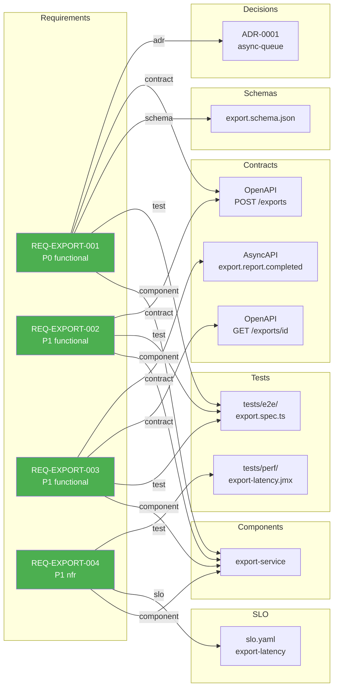

# Traceability Visualization: INIT-2026-009-smoke-test

Generated: 2026-04-12
Profile: Standard

## Coverage Summary

| Status | Count | REQ-IDs |
|--------|------:|---------|
| 🟢 Covered | 4 | REQ-EXPORT-001, REQ-EXPORT-002, REQ-EXPORT-003, REQ-EXPORT-004 |
| 🟡 Partial  | 0 | — |
| 🔴 Orphan   | 0 | — |

**Coverage: 4/4 REQ-IDs fully traced (100%)**

## Diagram

## Gaps

No gaps detected. All 4 REQ-IDs have at least 1 test link AND at least 1 contract or component link.
