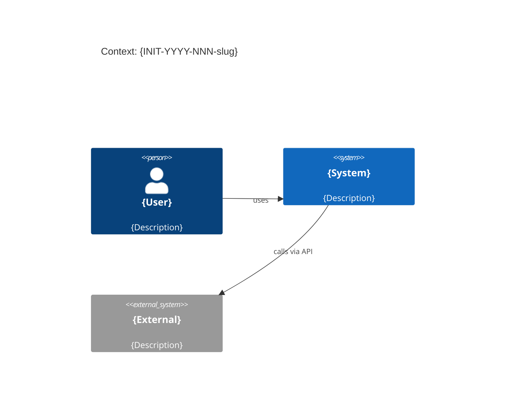

<!-- FILE: design.md -->
# Design: {INIT-YYYY-NNN-slug}

**Owner (Tech Lead):** @{team-or-person}
**Profile:** {Minimal|Standard|Extended}
**Last updated:** {YYYY-MM-DD}
**Related:** `prd.md`, `requirements.yml`, `decisions/`, `contracts/`, `ops/`

---

## Цели и ограничения

- **Goals:**
  1. {Goal 1}
  2. {Goal 2}
- **Constraints (MUST):** {регуляторика / latency / SLA / технологии / …}

## Контекст и границы (C4: Context)

- **Системы и акторы:** {список внешних систем и пользователей}
- **Trust boundaries** (Extended): {кратко}

## Архитектурная стратегия

- **Основной подход:** {async jobs | event-driven | sync API | …}
- **Почему:** {decision drivers → `decisions/{INIT}-ADR-0001-{slug}.md`}

## Ключевые строительные блоки (C4: Container)

| Контейнер | Ответственность | Данные | Масштабирование | Риски |
|---|---|---|---|---|
| `{service}` | {…} | {…} | {horizontal/vertical} | {…} |

## Контракты и данные

- **OpenAPI:** `contracts/openapi.yaml`
- **AsyncAPI** (если есть): `contracts/asyncapi.yaml`
- **JSON Schema:** `contracts/schemas/*.json`

## Качество и NFR (quality scenarios)

- **Performance:** {цели → `REQ-{SCOPE}-{NNN}`}
- **Reliability:** {SLO → `ops/slo.yaml`}
- **Security/Privacy** (Extended): `ops/threat-model.md`

## Развёртывание и миграции

- **Rollout strategy:** `delivery/rollout.md`
- **Data migration:** `delivery/migration.md` (Extended)

## Открытые вопросы

- {Q1} (owner: @{name}, due: {YYYY-MM-DD})
- {Q2} (owner: @{name}, due: {YYYY-MM-DD})
