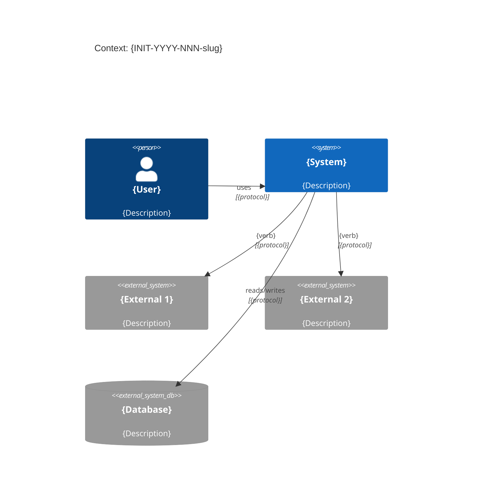
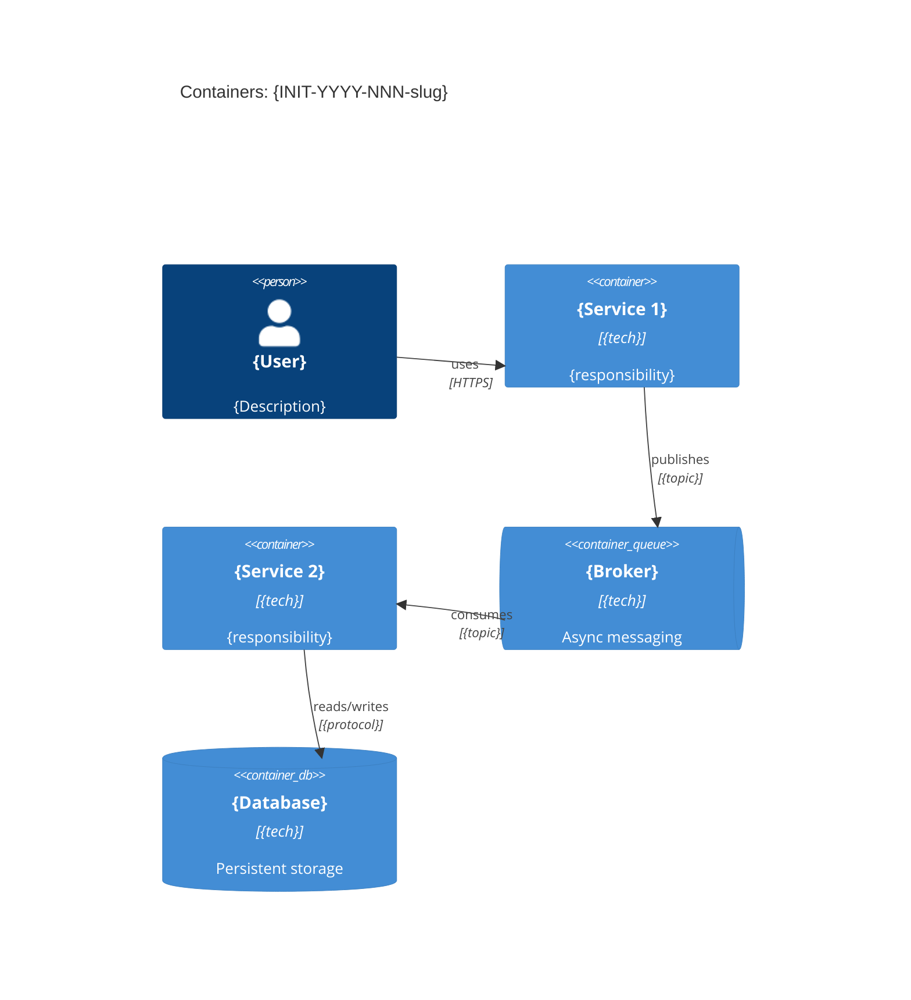

<!-- FILE: hld.md -->
<!-- Profile: обязателен для Extended, рекомендован для Standard -->
# HLD: {INIT-YYYY-NNN-slug}

> High-Level Design — архитектурный эскиз: границы, компоненты, интеграции, NFR.
> Владелец: Solution Architect / Tech Lead.
> Формат: arc42-lite.

**Initiative:** {INIT-YYYY-NNN-slug}
**Owner (SA / Tech Lead):** @{team-or-person}
**Date:** {YYYY-MM-DD}
**Version:** {1.0}
**Profile:** {Minimal|Standard|Extended}
**Status:** {draft | under-review | approved}
**Related:** `brd.md`, `prd.md`, `requirements.yml`, `decisions/`, `contracts/`

---

## 1. Цели и ограничения

**Цели архитектуры:**
1. {Цель 1 — качественный атрибут}
2. {Цель 2}

**Ограничения (MUST):**
- **Регуляторные:** {перечислить применимые}
- **Технологические:** {ограничения стека / инфраструктуры}
- **Организационные:** {зависимости, сроки, кадры}
- **SLA/SLO:** {целевые показатели из prd.md → `requirements.yml`}

## 2. Контекст и границы (C4: Context)

### 2.1 Системы и акторы

| Актор / Система | Тип | Взаимодействие | Протокол |
|---|---|---|---|
| {Пользователь} | Person | {что делает} | {UI / API} |
| {Подсистема X} | Internal | {что получает / отдаёт} | {REST / Kafka / …} |
| {Внешняя система Y} | External | {…} | {SOAP / REST / файлообмен} |

### 2.2 Контекстная диаграмма

### 2.3 Trust boundaries (Extended)

{Где проходят границы доверия: DMZ, внутренний контур, контур ПДн}

## 3. Архитектурная стратегия

**Основной подход:** {sync API / event-driven / batch ETL / hybrid}

**Ключевые паттерны:**
- {Паттерн 1}
- {Паттерн 2}
- {Паттерн 3}

**Связь с ADR:** решения зафиксированы в:
- `decisions/{INIT}-ADR-0001-{slug}.md` — {краткий смысл}
- `decisions/{INIT}-ADR-0002-{slug}.md` — {краткий смысл}

## 4. Строительные блоки (C4: Container)

| Контейнер / Сервис | Ответственность | Технология | Данные | Масштабирование | Риски |
|---|---|---|---|---|---|
| `{service-1}` | {…} | {…} | {…} | {horizontal / vertical} | {…} |
| `{service-2}` | {…} | {…} | {…} | {…} | {…} |
| `{broker}` | {…} | {Kafka / RabbitMQ} | {topics} | {partitions} | {…} |

### Контейнерная диаграмма

## 5. Интеграции и контракты

| # | Источник | Приёмник | Тип | Протокол / Формат | Контракт | Статус |
|---|---|---|---|---|---|---|
| 1 | {System A} | {Our Service} | Sync | REST / OpenAPI 3.1 | `contracts/openapi.yaml` | {draft / stable} |
| 2 | {Our Service} | {System B} | Async | Kafka / Avro | `contracts/asyncapi.yaml` | {draft / stable} |

## 6. Данные

### 6.1 Модель данных (верхний уровень)

| Сущность | Хранилище | Объём (оценка) | PII / sensitive | Retention |
|---|---|---|---|---|
| {Entity 1} | {PostgreSQL / S3 / …} | {N записей / GB} | {Да / Нет} | {N лет} |
| {Entity 2} | {…} | {…} | {…} | {…} |

> Детальные schemas → `contracts/schemas/*.json`, SQL migrations → `design.md`

## 7. Нефункциональные требования (Quality Scenarios)

| Атрибут | Сценарий | Target | Как проверяем | REQ-ID |
|---|---|---|---|---|
| **Performance** | {При N запросах, время ответа…} | {p95 < Xms} | {нагрузочный тест} | `REQ-{SCOPE}-{NNN}` |
| **Availability** | {При отказе компонента X…} | {99.X%, RTO < Yмин} | {failover test} | `REQ-{SCOPE}-{NNN}` |
| **Scalability** | {При росте нагрузки в Z раз…} | {…} | {scale test} | `REQ-{SCOPE}-{NNN}` |
| **Security** | {При попытке несанкц. доступа…} | {…} | {pen-test / чеклист} | `REQ-{SCOPE}-{NNN}` |
| **Resilience** | {При деградации storage…} | {graceful degradation} | {chaos test} | `REQ-{SCOPE}-{NNN}` |

**SLO:** `ops/slo.yaml`

## 8. Развёртывание

### 8.1 Стратегия

| Параметр | Значение |
|---|---|
| Тип деплоя | {canary / blue-green / rolling / feature-flag} |
| Rollback-стратегия | {описание: триггер + шаги} |
| Feature flag | {название флага, если есть} |
| Зависимости от инфраструктуры | {новые ресурсы} |

**Rollout plan:** `delivery/rollout.md`
**Migration plan (Extended):** `delivery/migration.md`

## 9. Сквозные аспекты (Cross-Cutting Concerns)

| Аспект | Подход | Инструмент / Стандарт |
|---|---|---|
| **Логирование** | {structured JSON logs, correlation ID} | {ELK / Loki / …} |
| **Метрики** | {RED/USE patterns} | {Prometheus + Grafana} |
| **Трейсинг** | {distributed tracing} | {Jaeger / Tempo} |
| **Аутентификация** | {OAuth2 / mTLS / API keys} | {Keycloak / …} |
| **Авторизация** | {RBAC / ABAC} | {OPA / custom} |
| **Обработка ошибок** | {retry, circuit breaker, DLQ} | {Resilience4j / …} |

## 10. Риски и технический долг

| # | Риск / Tech Debt | Влияние | Вероятность | Митигация | Владелец |
|---|---|---|---|---|---|
| 1 | {…} | {…} | {…} | {…} | {SA} |
| 2 | {…} | {…} | {…} | {…} | {…} |

## 11. Открытые вопросы

| # | Вопрос | Владелец | Срок | Статус |
|---|---|---|---|---|
| 1 | {…} | {ФИО} | {YYYY-MM-DD} | {открыт / закрыт} |

<!-- archkom: опциональные секции для контекста Архком ГНИВЦ -->
<!-- Раскомментировать при использовании --preset archkom -->

<!-- ## Оценка соответствия Архитектурному манифесту

| Принцип манифеста | Соответствует | Комментарий |
|---|---|---|
| {Принцип 1} | {Да / Нет / Waiver} | {обоснование} |
| {Принцип 2} | {Да / Нет} | {…} |
-->

<!-- ## Влияние на ВМД

| Параметр | Значение |
|---|---|
| Затрагивает ВМД | {Да / Нет} |
| Какие сущности | {перечень} |
| Тип изменения | {новая сущность / расширение} |
| Согласование | {выполнено / требуется} |
-->

<!-- ## Профиль нагрузки на БД

| Параметр | Значение | Методика |
|---|---|---|
| Ожидаемый TPS (пиковый) | {N} | {как считали} |
| Ожидаемый объём записи / час | {N записей} | {…} |
| Длительность транзакции (p95) | {Xms} | {…} |
| Заключение БД-домена | {допустимо / требуется оптимизация} | {чек-лист} |
-->

<!-- ## Уровень рассмотрения Архком

| Параметр | Значение |
|---|---|
| Уровень | {У1 / У2} |
| Контур | {Налог-3 / Налог-4 / Гибрид} |
| Обоснование контура | {…} |
-->

## 12. Связанные артефакты

| Артефакт | Файл / Ссылка | Статус |
|---|---|---|
| BRD | `brd.md` | {draft / approved / N/A} |
| PRD | `prd.md` | {approved} |
| ADR | `decisions/` | {перечень} |
| API-контракт | `contracts/openapi.yaml` | {draft / stable} |
| AsyncAPI | `contracts/asyncapi.yaml` | {draft / stable / N/A} |
| SLO | `ops/slo.yaml` | {draft / approved} |
| PRR | `ops/prr-checklist.md` | {open / passed} |
| Design (impl) | `design.md` | {draft} |

---

*Детали реализации (schemas, migrations, rollout steps) → `design.md`*

### Чек-лист полноты HLD

- [ ] C4 Context диаграмма актуальна
- [ ] Все интеграции перечислены с протоколами и контрактами
- [ ] NFR описаны как quality scenarios с targets и REQ-IDs
- [ ] Стратегия развёртывания и rollback определены
- [ ] Ключевые ADR созданы или запланированы
- [ ] Открытые вопросы зафиксированы с владельцами и сроками
