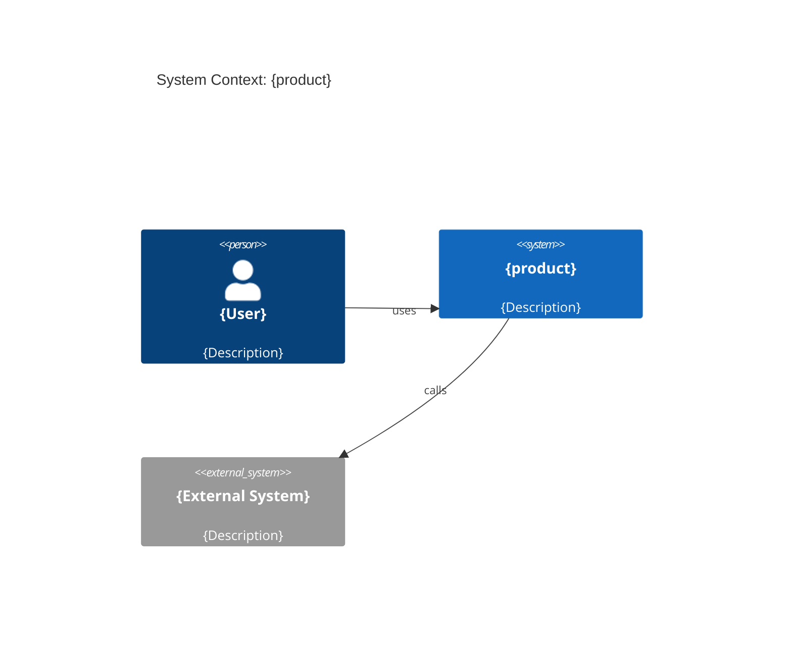

# Architecture: {product}

**Продукт:** {product}
**Владелец:** @{tech-lead}
**Последнее обновление:** {YYYY-MM-DD}

## Контекст (C4: Context)

{Описание системы, внешних акторов и систем}

## Контейнеры (C4: Container)

| Сервис | Ответственность | Технология | Репозиторий |
|---|---|---|---|
| `{service}` | {responsibility} | {tech} | `{repo-link}` |

## Ключевые ADR

- `decisions/{PROD}-0001-{slug}.md` — {краткий смысл}

## Домены

- Относится к домену: `domains/{domain}/`
