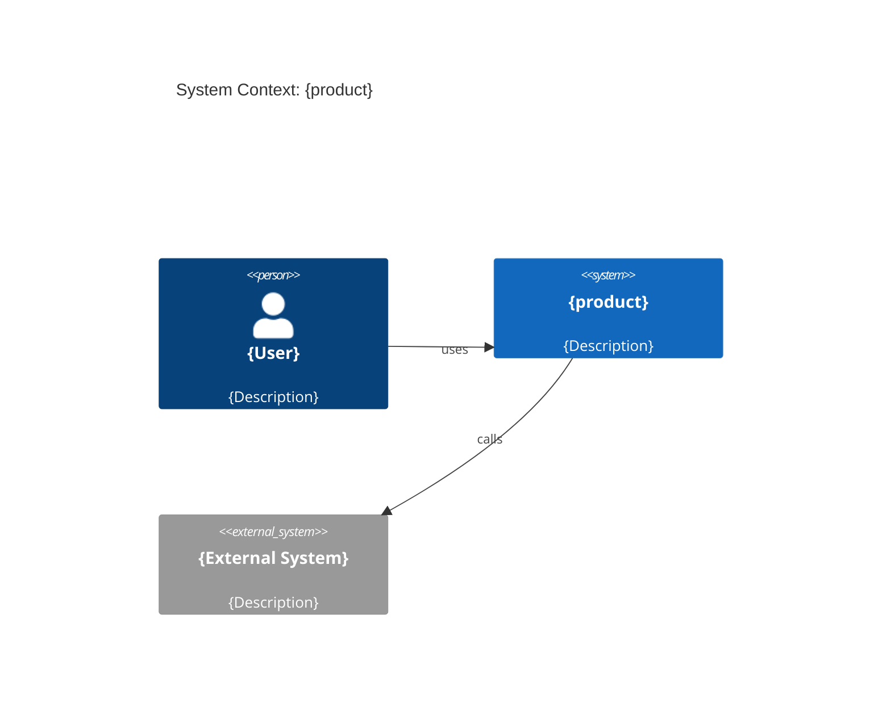

# Architecture: {product}

**Продукт:** {product}
**Владелец:** @{tech-lead}
**Последнее обновление:** {YYYY-MM-DD}

## Контекст (C4: Context)

{Описание системы, внешних акторов и систем}

## Контейнеры (C4: Container)

| Сервис | Ответственность | Технология | Репозиторий |
|---|---|---|---|
| `{service}` | {responsibility} | {tech} | `{repo-link}` |

## Ключевые ADR

- `decisions/{PROD}-0001-{slug}.md` — {краткий смысл}

## Классификация подсистем (онтология АИС)

> Раздел для проектов, следующих методологии АИС. Справочник: `domains/is-ontology/canonical-model/model.md`.

| Подсистема | Тип (ПС.Т) | Масштаб (ПС.М) | Вид деятельности | Владелец |
|------------|-----------|----------------|-----------------|----------|
| `{subsystem-1}` | `{ПС.Т.И \| ПС.Т.ПТ \| ПС.Т.П}` | `{ПС.М.М \| ПС.М.С \| ПС.М.Б}` | `{предметная область}` | `@{team}` |

## Домены

- Относится к домену: `domains/{domain}/`
