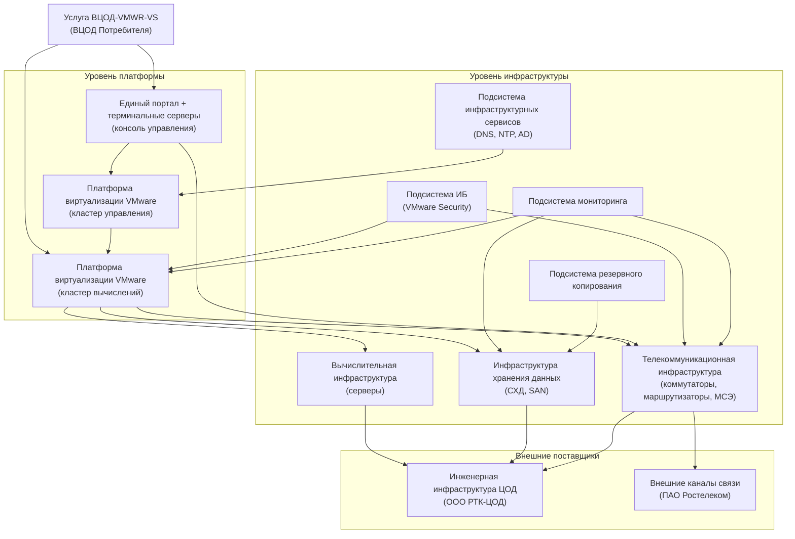
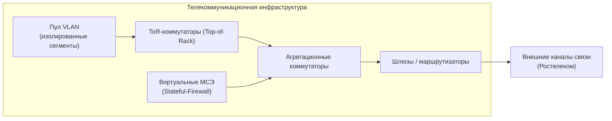
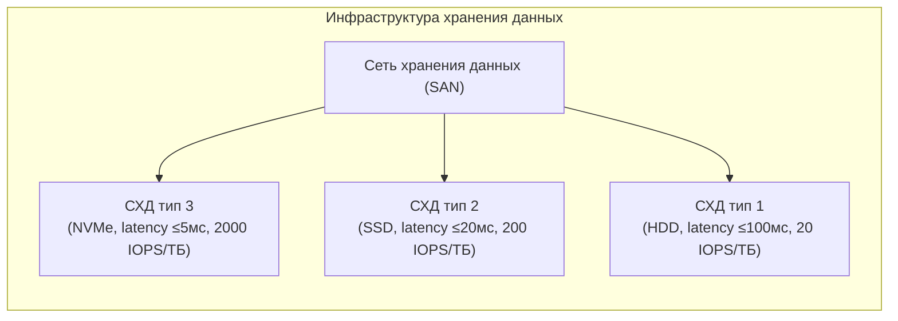
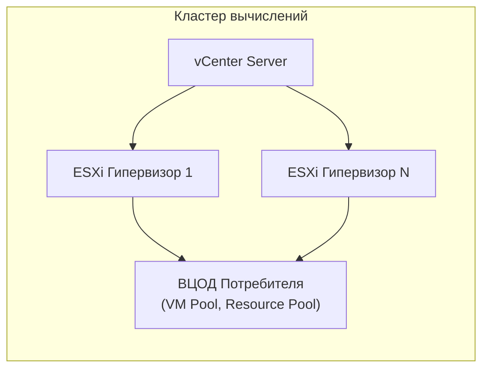
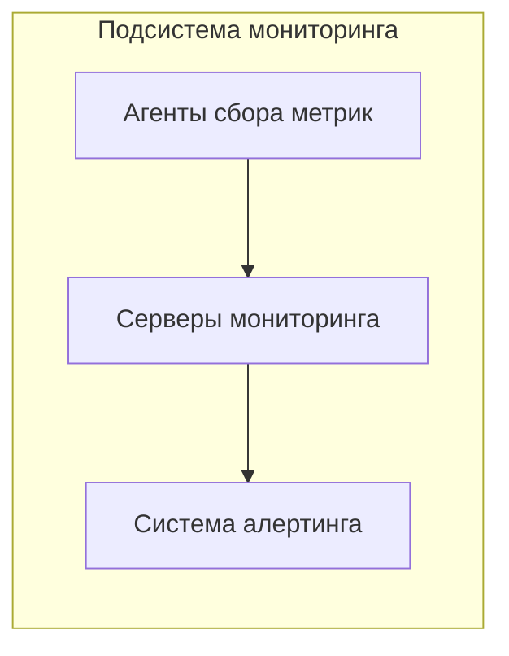

<!-- FILE: services/vtsod-vmwr-vs/rsm.md -->
<!-- Ресурсно-сервисная модель услуги ВЦОД-VMWR-VS.
     Источник: Внутренняя Спецификация Услуги v0.85, Приложение А (Рисунки А1–А9). -->

# Ресурсно-сервисная модель: ВЦОД-VMWR-VS

**Услуга:** Предоставление облачной платформы ВЦОД
**Продукт:** [`products/private-cloud/`](../../products/private-cloud/)
**Версия:** 0.85
**Дата:** 2026-03-02

---

## Условные обозначения

| Тип | Описание |
|---|---|
| 🔷 Прямоугольник | Компонент/подсистема под управлением ООО «РТК-ЦТ» |
| 🔶 Прямоугольник | Компонент под управлением внешнего поставщика |
| ➡️ Стрелка | Зависимость / потребление ресурса |

---

## Общая схема РСМ

---

## РСМ — Телекоммуникационная инфраструктура

Обеспечивает сетевую связность внутри ВЦОД, межсетевое экранирование и доступ в Интернет.

| Компонент | Тип | Ответственный |
|---|---|---|
| Агрегационные коммутаторы | Физическое оборудование | ООО «РТК-ЦТ» |
| ToR-коммутаторы | Физическое оборудование | ООО «РТК-ЦТ» |
| Виртуальные МСЭ | Виртуальный компонент | ООО «РТК-ЦТ» |
| Шлюзы/маршрутизаторы | Физическое оборудование | ООО «РТК-ЦТ» |
| Внешние каналы связи | Сервис | ПАО «Ростелеком» |

---

## РСМ — Инфраструктура хранения данных

Обеспечивает три типа дискового хранилища с разными характеристиками IOPS и задержки.

---

## РСМ — Платформа виртуализации VMware (кластер вычислений)

**Параметры лимитов платформы VMware:**

| Параметр | Мин | Макс |
|---|---|---|
| vCPU для одной ВМ | 1 | 48 |
| vRAM для одной ВМ | 1 Гб | 768 Гб |
| vHDD для одной ВМ | 1 Гб | 15 ТБ |
| Кол-во vHDD для одной ВМ | 1 | 26 |
| vNIC для одной ВМ | 1 | 10 |
| Пропускная способность vNIC | 1 Гбит/с | 10 Гбит/с |
| VLAN | 10 | 400 |
| Пропускная способность МСЭ | 2 Гбит/с | 10 Гбит/с |
| Терминальных серверов | 1 | 6 |
| Сетевых шлюзов | 1 на VLAN | — |

---

## РСМ — Подсистема мониторинга

Хранение исторических данных: **6 месяцев**.
