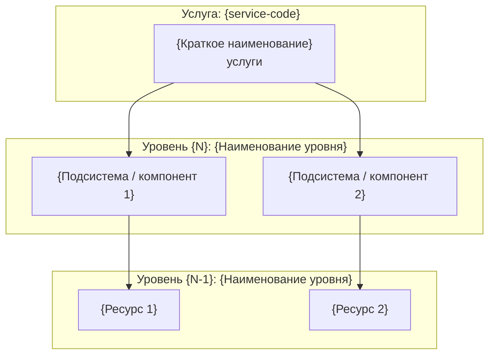
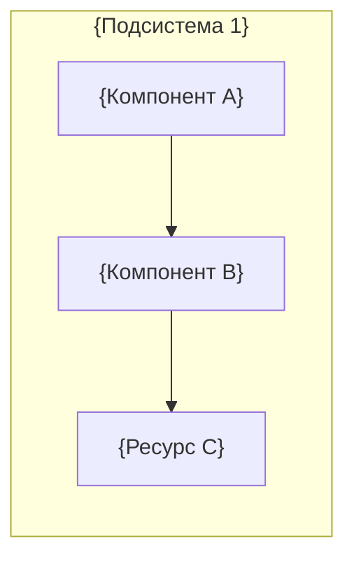
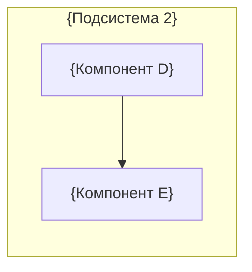
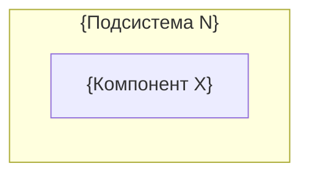

<!-- FILE: services/{service-code}/rsm.md -->
<!-- Ресурсно-сервисная модель (РСМ) — визуальное представление цепочки
     ресурсов, обеспечивающих предоставление услуги.
     Используйте Mermaid-диаграммы. Для каждого уровня РСМ — отдельный блок. -->

# Ресурсно-сервисная модель: {service-code}

**Услуга:** {Полное наименование}
**Продукт:** [`products/{product}/`](../../products/{product}/)
**Версия:** {0.x}
**Дата:** {YYYY-MM-DD}

---

## Условные обозначения

| Обозначение | Описание |
|---|---|
| 🔷 | Компонент, управляемый Исполнителем |
| 🔶 | Компонент, управляемый внешним поставщиком |
| ➡️ | Зависимость / потребление ресурса |

---

## Общая схема РСМ

---

## РСМ — {Подсистема 1}

{Описание подсистемы и её роли в цепочке предоставления услуги.}

| Компонент | Тип | Ответственный | Комментарий |
|---|---|---|---|
| {Компонент A} | {Физический\|Виртуальный\|ПО} | {Организация} | {примечание} |
| {Компонент B} | {…} | {…} | {…} |

---

## РСМ — {Подсистема 2}

{Описание подсистемы.}

---

## РСМ — {Подсистема N}

{Описание последней подсистемы.}

